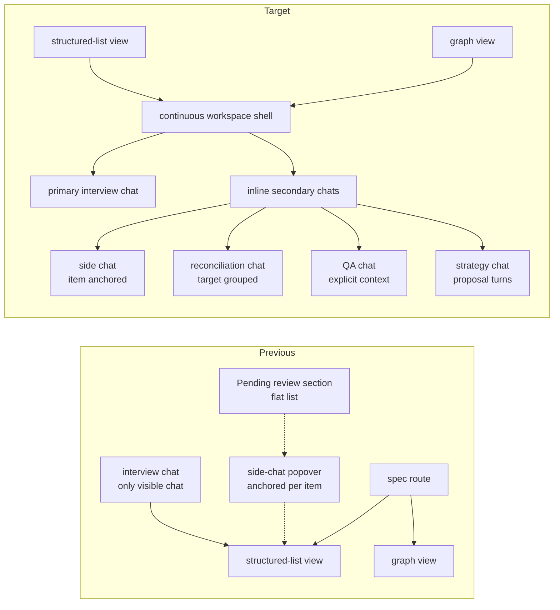

# Conversational Workspace Runtime — Umbrella Design

> Status: **active synthesis** — reconciled with `memory/SPEC.md` / `memory/PLAN.md` on 2026-05-15 after Track 1 shipped in FE-709.
>
> Scope: the runtime-cluster architecture following FE-674/V3.1 and FE-709. This doc synthesizes [MULTI_CHAT.md](./MULTI_CHAT.md), [SIDE_CHAT.md](./SIDE_CHAT.md), [PATCH_LEDGER.md](./PATCH_LEDGER.md), and [CONTINUOUS_WORKSPACE_HYBRID.md](./CONTINUOUS_WORKSPACE_HYBRID.md) into the current **chat/turn-first** Conversational Workspace Runtime.
>
> Authority: this doc owns cross-subsystem synthesis. `memory/SPEC.md` owns product/architecture truth; `memory/PLAN.md` owns frontier sequencing. Sibling docs remain subsystem/source references for shipped substrate details, UI history, algorithms, and design pressure.

## 1. Purpose and positioning

The **Conversational Workspace Runtime** is the architectural umbrella for turning the shipped continuous workspace shell into a durable multi-chat workspace:

1. The workspace hosts a primary interview chat plus inline/collapsible **secondary chats** for side, reconciliation, QA, and strategy work.
2. Existing `chat` + `turn` persistence is the near-term runtime primitive. A schema-level `thread` table is explicitly deferred until chat/turn proves insufficient.
3. Reconciliation, proposal turns, and future agent-mediated work stay conversationally visible while semantic mutations remain server-authoritative through changesets.
4. Prompt context is **transcript-first**: extra graph/workspace context enters the transcript as explicit context snapshot artifacts stored on turns. Graph-item handles track explicit anchors/mentions, but freshness waits for real item versions from the changeset ledger; context is not a hidden persisted context-spec table.

### What this doc is not

- Not an implementation plan. The sub-tracks in §5 enter `/ln-plan` as frontier items.
- Not a UX spec. It names runtime ownership and cutover targets, not final visual design.
- Not a new authority for product ontology, changeset semantics, or prompt/context pack policy; those live in SPEC/PLAN and the relevant sibling docs.

### Relationship to sibling docs

| Sibling doc | Role going forward |
| --- | --- |
| [MULTI_CHAT.md](./MULTI_CHAT.md) | Shipped substrate reference for `chat`, chat-owned turns, primary-chat transition invariants, and `reconciliation_need`. Future runtime work builds on that substrate rather than adding schema-level threads by default. |
| [SIDE_CHAT.md](./SIDE_CHAT.md) | User-surface history and V1–V3.1 behavior. Its V4 persistent-history direction is superseded by durable secondary chats rendered inline in the workspace. |
| [PATCH_LEDGER.md](./PATCH_LEDGER.md) | Historical design pressure for semantic mutation history and reconciliation ordering. Future-facing vocabulary is `changeset` / `change`; target-ordering mechanics remain useful. |
| [CONTINUOUS_WORKSPACE_HYBRID.md](./CONTINUOUS_WORKSPACE_HYBRID.md) | Source note for the shipped Track 1 workspace shell and deferred route-collapse question. Runtime work builds on FE-709 rather than re-deciding the shell. |
| [INTENT_GRAPH_SEMANTICS.md](./INTENT_GRAPH_SEMANTICS.md) | Authority for relation-policy directionality, endpoint-relative labels, and neighborhood snapshot modes used by context provision and reconciliation impact. |
| [SUBSTRATE_STRANGLER_COORDINATION.md](./SUBSTRATE_STRANGLER_COORDINATION.md) | Coordination forecast for what backend/server functions and capability contracts frontend work should expect as FE-700/FE-701/Track 5 land. |

### Supersession map

| Claim type | Current authority | Superseded / historical |
| --- | --- | --- |
| Runtime concept and cross-track direction | This document + SPEC/PLAN | Reading MULTI_CHAT / SIDE_CHAT / PATCH_LEDGER as independent future roadmaps. |
| Secondary conversation persistence | `chat` + `turn` substrate, with secondary chats as product/runtime usage | Treating a `thread` table, `turn.thread_id`, or `thread_context_item` as accepted near-term schema. |
| Side-chat user surface | Inline/collapsible secondary chats in the workspace | `SideChatPopover`, top-bar staged patch list, and standalone Pending review as long-term surfaces. |
| Semantic mutation history | Changeset/change ledger | New durable schema or operation names using `patch` / `patch_change`. |
| Prompt context | Transcript-first snapshots stored as turn artifacts; item handles are lightweight anchor/mention references refreshed only with real item versions | Hidden persisted context-spec records as the default context authority; temporary content fingerprints as a durable refresh oracle. |
| Reconciliation vs graph review | Reconciliation needs are process debt from known disturbances; graph-review findings are critique artifacts | Using `reconciliation_need` as the table for all graph quality findings. |
| Agent mutation authority | Brunch-owned capability/handler contracts | Agents writing directly through ORM helpers or harness-specific route wrappers. |

Live open questions are now narrower: secondary-chat lifecycle/rendering shape over chat/turn, reconciliation chat lifecycle, direct-edit chat-opening UX, `#` mention disambiguation, context-handle storage/expiry, compact snapshot serialization, async classifier scheduling, endpoint-relative relation-label UI affordances, and migration of existing client patch terminology.

## 2. The shift, at a glance



**What changes for the user**

- One workspace surface can show the primary interview and secondary chats inline, usually collapsed until relevant.
- Reconciliation becomes an in-stream secondary chat, not a separate review section.
- The side-chat popover and Pending review section retire after parity exists over durable secondary chats.
- Direct edits stay fast-path. Hard-impact edits create reconciliation needs and may focus a side/reconciliation chat depending on context.
- Auto-confirmed reconciliation never surfaces. Only `auto-edit` and `substantive` need user attention.

**What changes for the substrate**

- The `chat` table stays the durable conversational primitive; turns remain chat-owned.
- Secondary chat kinds (`side`, `reconciliation`, `qa`, `strategy`) are represented through chat metadata / strategy state over chat+turn unless a later RFC proves a `thread` table is necessary.
- Changeset/change records become the semantic mutation spine; existing client “patch” state is transitional.
- Context provision becomes explicit transcript content: context snapshots are inserted into turns, and context handles track explicitly referenced graph items. Stale-handle refresh waits for changeset-backed item versions rather than a temporary content fingerprint.

## 3. Architecture layers

### 3.1 Workspace shell — Track 1, shipped

The spec route renders a continuous workspace: realized phase sections, sidebar navigation, scroll/focus behavior, primary chat, projected controls, graph/sidebar affordances, and future inline secondary chats. This shipped in FE-709 as `continuous-workspace`.

The shell is the structural prerequisite for absorbing side-chat and pending-review surfaces. Runtime work should build on the shipped hybrid shell and preserve phase addressability, single actionable frontier semantics, and workspace/read-model authority.

### 3.2 Chat runtime — inline secondary chats over chat/turn

Track 2 implements inline/collapsible secondary chats using existing `chat` + `turn` persistence.

**Primitives**

- `chat` — durable conversation container inside one specification. One primary interview chat exists; secondary chats are additional chat rows for side, reconciliation, QA, or strategy work.
- `turn` — chat-owned conversational event or assistant/system-first proposal/kickoff. Each active/resumable chat has at most one open assistant/system-first frontier turn.
- `chat.kind` / chat-local strategy metadata — distinguishes `side`, `reconciliation`, `qa`, and `strategy` behavior without creating semantic truth.
- **Turn-zero** — an assistant/system kickoff turn that seeds a secondary chat with explicit context snapshots and options before the user responds. The first Track 2 version can render snapshots supplied by server fixtures/builders without owning the full Track 5 refresh lifecycle.

**Explicit deferral**

Do not add a `thread` table, `turn.thread_id`, or schema-level thread hierarchy in Track 2. The follow-up question is not “which thread schema?” but “what, if anything, can chat/turn not express after secondary-chat rendering, one-open-frontier semantics, strategy state, and context snapshots are implemented?”

**Cutover targets**

- Retire `SideChatPopover` as the long-term side-chat surface after durable inline secondary chats reach parity.
- Retire the transient staged-patches strip as a semantic source of truth. In-flight proposals may remain turn artifacts, but accepted mutations flow through changesets.
- Preserve existing primary interview behavior during the transition.

### 3.3 Reconciliation runtime — in-stream secondary chat

Track 3 absorbs reconciliation into the workspace as a target-grouped secondary chat.

**Trigger model**

- **Async by default** — when `reconciliation_need` rows enter the queue, a background runner/classifier processes unclassified rows. Auto-confirmed rows resolve invisibly. Auto-edit rows queue one-click suggestions. Substantive rows accumulate for judgment.
- **User trigger** — “Reconcile Now” materializes or refocuses the reconciliation chat so the user can batch-review, retry, or force classification.

**Chat shape**

A reconciliation chat is a durable secondary `chat`, grouped by target and sorted upstream-first using the PATCH_LEDGER target-ordering pressure. Classifier labels (`auto-confirm`, `auto-edit`, `substantive`) are metadata on needs inside target groups, not the primary grouping axis.

The reconciliation chat can host a conversation about substantive needs, but it does not own semantic truth. Accepted resolutions route through Brunch-owned handlers and, once Track 4 lands, durable changesets.

**Surfacing rules**

- Auto-confirmed rows do not surface.
- Open non-auto-confirmed needs may show subtle badges on structured-list / graph items.
- The workspace shell may show an active reconciliation count and Reconcile Now affordance without stealing focus.

### 3.4 Changeset ledger — semantic mutation spine

Track 4 introduces durable semantic mutation history.

**Vocabulary**

- `changeset` — one coherent submitted semantic mutation bundle.
- `change` — one atomic mutation inside a changeset.
- “Patch” is historical/transitional. It may remain in legacy client code until migrated, but it is not target vocabulary.

**Attribution**

- Every change belongs to one changeset.
- Every changeset records provenance: originating turn/chat where applicable, action source, actor, and base semantic state.
- `reconciliation_need.caused_by_changeset_id` replaces/connects the historical patch placeholder.
- Proposal turns are not mutations until accepted.

**Direct edits**

A direct graph/list edit writes a changeset and then opens/deduplicates reconciliation needs according to relation policy. The UX may focus an item-anchored side chat, append to a reconciliation chat, or remain in-place; that is a Track 3/4 interaction decision, not a semantic-history decision.

### 3.5 Context provision — transcript-first snapshots and handles

Track 5 provides prompt context for primary and secondary chats without a hidden persisted context-spec table.

**Model**

- A chat primarily uses its own transcript as prompt context.
- Extra graph/workspace context is inserted into the transcript as explicit **context snapshot** artifacts.
- A **context handle** records that a chat is tracking explicit graph subjects across turns, usually because a chat was anchored on an item or the user mentioned one with `#`. Before new assistant turns, stale handles can trigger fresh snapshots when the subject's changeset-backed item version has advanced. Do not bless temporary content fingerprints as the durable freshness oracle.
- Snapshots are historical: they do not mutate when source truth changes.

**Turn-zero**

Secondary chats begin with a kickoff turn that inserts kind-appropriate snapshots and offers options. Track 2 can create/render turn-zero artifacts before Track 5 fully lands, but the snapshots should already follow the transcript-first artifact model. Example defaults:

- `side` — anchor item snapshot plus relation-policy-rendered neighborhood and open needs against the anchor.
- `reconciliation` — target group snapshots plus relevant needs and relation-policy context.
- `qa` — user-selected / `#`-mentioned items and enough graph metadata to answer safely.
- `strategy` — current phase/workflow state plus the fixed premise and proposal constraints.

**Snapshot builder family**

The server-side context layer should expose reusable builders; frontend runtime code should consume their artifacts rather than reconstruct graph meaning locally:

| Builder shape | Purpose |
| --- | --- |
| `buildIntentItemContextSnapshot({ specificationId, itemIds })` | Explicit item inclusion and `#` mention context. |
| `buildIntentNeighborhoodContextSnapshot({ specificationId, anchorItemIds, mode })` | Side-chat, QA, edit-impact, and reconciliation context around anchors. Initial modes: `immediate`, `dependencies`, `dependents`, `evidence`, `reconciliation`. |
| `buildEconomicIntentGraphContextSnapshot({ specificationId, budget })` | Compact whole-graph briefing for unanchored chats in existing specifications. |
| `buildHistoricalIntentNeighborhoodSnapshot({ itemId, basis })` | Later, once changesets can identify original-capture and last-update surroundings. |
| `resolveIntentItemReferences({ specificationId, refs })` | Server-owned `#` reference-code/name resolution scoped to one specification. |

Neighborhood labels and buckets (`dependencies`, `dependents`, `evidence`, etc.) come from relation policy endpoint-relative labels. They are not string reversals of `knowledge_edge.from_item_id` / `to_item_id`.

**`#` mention**

A mention such as `#AS-12` resolves against intent items through a server-owned resolver scoped to the specification. Resolution inserts a context snapshot and, once real item versions exist, activates or refreshes a handle for the mentioned subject. Ambiguity should produce an explicit disambiguation/recovery artifact rather than silently omitting context. Revocation, expiry, and storage shape are Track 5 design details, but the transcript remains the durable replay surface.

**Serialization**

Context-pack builders own compact rendering. TOON or another compact graph serializer may format inserted snapshots, but the serializer is an implementation choice, not an authority boundary.

## 4. Cross-cutting decisions

### 4.1 Vocabulary

- `chat` — durable conversation container inside a specification.
- `secondary chat` — non-primary chat rendered inline/collapsible in the workspace; product/runtime use of `chat`, not a separate thread table.
- `turn-zero` — kickoff turn that seeds a secondary chat.
- `context snapshot` — explicit turn artifact recording inserted graph/workspace context at a point in time.
- `neighborhood snapshot` — context snapshot centered on one or more intent items, with relation-policy-selected modes such as immediate, dependencies, dependents/impact, evidence, reconciliation, and later historical.
- `context handle` — lightweight active reference to explicit graph subjects, causing future freshness checks and new snapshots only when changeset-backed item versions advance.
- `changeset` / `change` — durable semantic mutation vocabulary.
- “Thread” — historical or generic UI language only in this doc. It is not target schema vocabulary.
- “Patch” — historical/transitional client vocabulary only.

### 4.2 What never surfaces to the user

- Auto-confirmed reconciliation rows.
- Successful classifier runs that produce no user-relevant work.
- Changeset bookkeeping as a separate user-facing object when the resulting semantic state is enough.

### 4.3 What surfaces subtly

- Open non-auto-confirmed reconciliation needs against an item.
- Active reconciliation chat count / Reconcile Now affordance.
- Failed classifier rows as recoverable state.

### 4.4 What surfaces actively

- Substantive reconciliation needs with judgment affordances.
- Hard-impact direct edits when user attention is needed.
- Assistant/system-first proposal turns in strategy, graph-review, or reconciliation chats.

## 5. Umbrella structure — sub-tracks

```text
Track 1: Workspace shell — shipped FE-709
  ├─ Cumulative phase sections
  ├─ Sidebar section-active behavior
  └─ Structured-list and graph views as workspace-aware peers

Track 2: Chat runtime — inline secondary chats
  ├─ Represent side/reconciliation/qa/strategy chats over chat+turn
  ├─ Render secondary chats inline/collapsible in the workspace
  ├─ Preserve one open assistant/system-first frontier turn per active chat
  ├─ Seed secondary chats with turn-zero kickoff + context snapshots
  └─ Retire SideChatPopover after parity

Track 3: Reconciliation runtime
  ├─ Target-grouped reconciliation chat
  ├─ Async-by-default classifier scheduling
  ├─ Reconcile Now trigger in workspace shell
  ├─ Retire standalone PendingReviewSection after parity
  └─ Auto-edit one-click apply + substantive judgment affordances

Track 4: Changeset ledger
  ├─ changeset / change tables and mutation handlers
  ├─ latest/base changeset identity for proposal staleness
  ├─ reconciliation_need.caused_by_changeset_id wiring
  ├─ Direct-edit and agent-resolution paths write changesets
  └─ Migrate existing client patch vocabulary/state

Track 5: Chat context provision
  ├─ Context snapshot turn artifacts
  ├─ Active graph-item handles and stale-handle refresh after real item versions exist
  ├─ # mention parser/resolver/disambiguation
  ├─ Item, neighborhood-mode, economic graph, and later historical snapshot builders
  ├─ Turn-zero prompt assembly per chat kind/strategy
  └─ Structured assertions + selected golden renderings for snapshots

Dependencies
  Track 1 (shell) —enables→ Track 2 (secondary chats)
  Track 2 —enables→ Track 3 (in-stream reconciliation)
  Track 2 —enables→ Track 5 (turn-zero, mentions, handles)
  Track 4 (changeset) —parallel with→ Track 2
  Track 4 —enables→ richer attribution in Track 3
  Track 4 —enables→ real item versions and historical neighborhoods in Track 5
```

**Why this order**

- The shell came first because secondary chats need a stable host.
- The chat runtime is the unblocker for reconciliation absorption and transcript-first context provision.
- The changeset ledger can run in parallel because semantic history is independent of inline rendering.
- Context provision and reconciliation in-stream parallelize once Track 2 settles the initiating chat/anchor shape.

## 6. Cross-document audit

| Parallel design | Implication for the runtime cluster |
| --- | --- |
| [INTENT_GRAPH_SEMANTICS.md](./INTENT_GRAPH_SEMANTICS.md) | Reconciliation, direct-edit cascade, and context snapshots must consult relation-policy directionality, endpoint-relative labels, and edge support/status. Runtime code cannot infer affected endpoints or dependency/dependent labels from raw edge direction. |
| [SPEC_EVOLUTION_STRATEGIES.md](./SPEC_EVOLUTION_STRATEGIES.md) | Strategy is chat-local process state. Scenario options, graph-review findings, and reconciliation suggestions are proposal turns until accepted; accepted bundles become coherent changesets. |
| [AGENT_MUTATION_SURFACE.md](./AGENT_MUTATION_SURFACE.md) | Agent-originated writes enter through Brunch-owned capability/handler contracts, not direct ORM or route-wrapper mutation authority. |
| [SUBSTRATE_STRANGLER_COORDINATION.md](./SUBSTRATE_STRANGLER_COORDINATION.md) | Existing frontend REST/SSE contracts remain stable while backend work produces shared handlers, relation-policy functions, context snapshot builders, and capability tools. |
| Prompt/context substrate (SPEC D139/D140/D154, A84/A85/A95) | Chat context provision consumes prompt/context-pack policy. Snapshots are built by context-pack builders and stored on turns; handles organize refresh once changeset-backed item versions exist. |
| [BEHAVIORAL_KERNELS.md](./BEHAVIORAL_KERNELS.md) | Kernel-driven questions produce typed intent artifacts; the runtime provides chat/context affordances but not a separate artifact ontology. |
| [ln-skills/EVOLUTION.md](./ln-skills/EVOLUTION.md) | Dev-layer file-backed registry ideas are separate from product runtime persistence. |

Audit result: the runtime is coherent when `chat` is conversational process, chat-local strategy remains turn/proposal state, prompt/context packs assemble context snapshots, relation policy owns endpoint-relative labels and impact direction, changesets own semantic mutation history and item versions, reconciliation needs represent process debt, and graph review remains a separate quality oracle.

## 7. Out of scope / explicit deferrals

- Pixel-level secondary-chat UX and designer consultation.
- Demo-bound prioritization; PLAN sequencing owns frontier order.
- Schema-level `thread` tables or `turn.thread_id`; deferred until chat/turn insufficiency is proven.
- Hidden persisted context-spec tables; deferred unless transcript-first snapshots/handles fail.
- Temporary content/edge fingerprints as the durable context-handle freshness oracle; handle freshness waits for changeset-backed item versions.
- Continuous-workspace route collapse; FE-709 hybrid shell remains the host.
- Architect/generator loop; horizon until changesets and reconciliation surfaces stabilize.
- Provider setup, gitignore assist, and productized web research; separate PLAN frontiers.

## 8. Open questions

- **Secondary-chat lifecycle** — when to create, refocus, collapse, archive, or resume side/reconciliation/qa/strategy chats.
- **Direct-edit attention UX** — when hard-impact direct edits focus an item side chat, a reconciliation chat, both, or neither.
- **Context-handle storage and expiry** — whether handles are explicit rows, turn-derived state, or both; how revocation and expiry are represented once real item versions exist.
- **`#` mention disambiguation** — reference-code/name matching and ambiguous-result UX.
- **Compact snapshot serialization** — TOON vs a minimal internal serializer; structured assertions plus selected golden renderings are the oracle, not exact prose everywhere.
- **Async-classifier scheduling** — in-process loop vs queue substrate; promote only if outer-loop behavior needs it.
- **Reconciliation chat lifecycle** — one persistent reconciliation chat per spec vs batch/invocation chats.
- **Generic sub-agent runs** — whether Track 2 owns a general sub-agent affordance or only the named secondary chat kinds for now.
- **Client patch-state migration** — stepwise renaming/folding into durable changesets.

## 9. Traceability

**Anchors**

- Requirements 10, 39, 42, 44, 45.
- Assumptions A49, A88, A94, A95, A96.
- Decisions D135, D137, D138, D139, D140, D143, D146, D148, D149, D153, D154.
- Invariants I111, I112, I113, I114, I116, I117, I118, I120.
- PLAN frontier items: `chat-runtime-secondary-chats`, `reconciliation-runtime`, `changeset-ledger`, `chat-context-provision`.

**Likely future decisions when Tracks 2–5 are scoped**

- Secondary-chat lifecycle and anchor policy.
- Reconciliation chat lifecycle.
- Changeset migration sequence.
- Direct-edit attention/focus policy.
- Context-handle persistence/expiry policy after changeset-backed item versions exist.
- Snapshot-builder API and artifact schema boundaries for item, neighborhood, economic graph, and historical neighborhoods.

**Cross-references**

- [MULTI_CHAT.md](./MULTI_CHAT.md) §3 substrate, §4 context model, §5 reconciliation primitive
- [SIDE_CHAT.md](./SIDE_CHAT.md) §5 edit-patch routing, §13 substrate alignment
- [PATCH_LEDGER.md](./PATCH_LEDGER.md) §Reconciliation Flow, §Target Ordering, §Phase 2 Patch Ledger
- [CONTINUOUS_WORKSPACE_HYBRID.md](./CONTINUOUS_WORKSPACE_HYBRID.md) §Recommended direction
- [memory/SPEC.md](../../memory/SPEC.md) Future Direction Register and Lexicon
- [memory/PLAN.md](../../memory/PLAN.md) Sequencing, Dependencies, and runtime frontier definitions
- [SUBSTRATE_STRANGLER_COORDINATION.md](./SUBSTRATE_STRANGLER_COORDINATION.md) §Upcoming substrate waves and expected interfaces
- [INTENT_GRAPH_SEMANTICS.md](./INTENT_GRAPH_SEMANTICS.md) §Relation-policy registry and endpoint-relative labels
