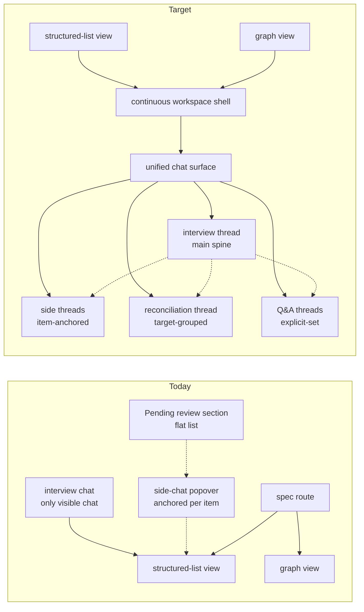

# Conversational Workspace Runtime — Umbrella Design

> Status: **active synthesis** — consolidated runtime-cluster concept. Output of brainstorm 2026-05-12, anchored on the two sync calls of 2026-05-11 (UX review of V3.1 side-chat) and 2026-05-12 (architecture review, post-V3.1 direction); audited during FE-705 reconciliation cleanup on 2026-05-13.
>
> Scope: the next major architectural arc after FE-674's V3.1 closes. Synthesizes [MULTI_CHAT.md](./MULTI_CHAT.md), [SIDE_CHAT.md](./SIDE_CHAT.md), [PATCH_LEDGER.md](./PATCH_LEDGER.md), and [CONTINUOUS_WORKSPACE_HYBRID.md](./CONTINUOUS_WORKSPACE_HYBRID.md) into a single concept for the conversational workspace runtime.
>
> Authority: this doc owns the cross-subsystem synthesis. The sibling docs remain subsystem/source references for shipped substrate details, user-surface history, algorithms, and open questions. Build slices fall out of this map via `/ln-plan`; this doc deliberately does **not** sequence implementation.

## 1. Purpose and positioning

This is the **umbrella design** for what follows FE-674. It does three things:

1. Names the umbrella as **Conversational Workspace Runtime** — the user-visible workspace shell hosts a single unified chat surface; threads and sub-runs are reified data rendered inline; reconciliation and changesets attribute conversationally to that surface.
2. Resolves cross-subsystem decisions that the four sibling docs left open, captured deltas from the 2026-05-11 (UX review) and 2026-05-12 (architecture review) calls.
3. Names the umbrella's **sub-tracks** so the umbrella Linear issue is legible without prescribing slice sequence.

### What this doc is *not*

- Not an implementation plan. The sub-tracks in §5 each enter `/ln-plan` separately when picked up.
- Not a re-derivation of the sibling docs. Where MULTI_CHAT / SIDE_CHAT / PATCH_LEDGER / CONTINUOUS_WORKSPACE_HYBRID already settle a question, this doc points there.
- Not a UX spec. The shipped V3.1 surface, the UX review feedback, and any subsequent design pass own that.
- Not the FE-674 polish backlog (raised in UX review). Those flow into the existing branch sequence; see §7.

### Relationship to the sibling docs

| Sibling doc | Role going forward |
|---|---|
| [MULTI_CHAT.md](./MULTI_CHAT.md) | Shipped Phase 1 substrate reference; the `chat` table and `reconciliation_need` queue it introduced are primitives this synthesis inherits. Its schema/migration details remain useful, but future thread and reconciliation product shape is governed here. |
| [SIDE_CHAT.md](./SIDE_CHAT.md) | User-surface history and phasing for V1 / V2 / V3.0 / V3.1, plus V4 notes. Future persistent side-chat history is folded into the unified chat/thread runtime here. |
| [PATCH_LEDGER.md](./PATCH_LEDGER.md) | Historical design pressure for semantic mutation history and reconciliation ordering. Its target-ordering algorithm remains useful; target vocabulary is **changeset/change** going forward, per SPEC/PLAN. |
| [CONTINUOUS_WORKSPACE_HYBRID.md](./CONTINUOUS_WORKSPACE_HYBRID.md) | Workspace-shell shape exploration. It still owns the route-alias / workspace-controller / chart-backed-supervisor choice; this doc treats that shell as the host prerequisite for runtime work. |

## 2. The shift, at a glance



**What changes for the user**

- One main chat surface per spec, not many popovers. Threads / sub-runs render inline as collapsibles.
- Reconciliation absorbs into the chat surface as a target-grouped thread, not a separate review section.
- The side-chat popover and the Pending review section both retire into in-stream threads over the umbrella's lifetime.
- Direct edits stay fast-path. They open a thread automatically only when impact exceeds `soft`.
- Auto-confirmed reconciliation never surfaces. Only `auto-edit` and `substantive` reach the user.

**What changes for the substrate**

- The `chat` table stays the durable primitive; the umbrella adds a substrate seam for threads (one of three shapes — see §3.2 / §8).
- `reconciliation_need.caused_by_changeset_id` becomes real once changesets land (§3.4). The `caused_by_*` placeholders already in MULTI_CHAT.md §3.4 are the seam.
- The `changeset` / `change` records (PATCH_LEDGER.md Phase 2) become first-class. The transient client-side "patch" list in the V3.1 side-chat surface goes away with the popover.
- Context-provision becomes a typed thread-scoped concern with TOON notation, # mention as a substrate-level mutation, and turn-zero seeding (§3.5).

## 3. Architecture layers

Top-down from the surface the user sees to the substrate underneath. Each layer is one sub-track in §5.

### 3.1 Workspace shell

The spec route renders a continuous workspace, not a stack of independent views. Phase sections, sidebar navigation, and scroll/focus behavior belong here. The chat runtime mounts inside the shell.

This is the [CONTINUOUS_WORKSPACE_HYBRID.md](./CONTINUOUS_WORKSPACE_HYBRID.md) frontier already in PLAN.md §Active. That doc owns the shape choice (route-alias / workspace controller / chart-backed supervisor). This umbrella names the workspace shell as a **structural prerequisite** for the chat runtime: the runtime needs a stable host before it can absorb side-chat / pending-review surfaces. That is a dependency constraint, not a ship-order commitment — `/ln-plan` decides actual sequencing (see the dependency arrows in §5). Structured-list view and graph view become workspace-aware peers, not standalone routes.

### 3.2 Chat runtime — unified surface, threads as primitive

One main chat per spec is visible. Threads, sub-runs, and side conversations are reified data rendered inline as collapsibles (Cursor-style). This is the user-visible commitment from Q3 of the brainstorm.

**Primitives**

- `chat` — already shipped per MULTI_CHAT.md. One interview chat per spec, addressable via `specification.primary_chat_id`.
- **Thread** — a sub-run inside the interview chat. **Substrate shape is an open question** (§8). Three plausible options:
  - **(p) `parent_chat_id` on `chat`** — a thread is just a child `chat` row. Smallest delta from MULTI_CHAT.md; the chat table absorbs hierarchy.
  - **(q) New `thread` table** — chats own threads; threads own turns. Spec → chat → thread → turn. Most expressive, biggest schema delta.
  - **(r) Pure UI-rendering** — chats stay sibling-of-spec; UI renders one chat's children inline. Substrate unchanged.

  This umbrella does **not** pick yet. A follow-up RFC (sub-track 2 in §5) decides based on what the in-stream rendering and # mention substrate actually need.
- **Thread kinds** — `interview` (the spine), `side` (item-anchored), `reconciliation` (target-grouped), `qa` (explicit-set, user-initiated). Kind determines context-spec defaults (§3.5) and turn-zero behavior. Kinds are metadata, not hard constraints on what happens inside. These thread kinds are **conceptually distinct from the existing `chat.kind` enum** (currently `interview | side_chat` per MULTI_CHAT.md §3) — how they're persisted (a new `thread.kind` column, an extension of `chat.kind`, or UI-only metadata) is part of the substrate choice deferred below.
- **Turn-zero** — every thread starts with an `assistant` turn that prompts the user with kind-appropriate options. Existing `turn_kind = 'kickoff'` is the seam.

**What retires when this lands**

- The `SideChatPopover` UI surface (per-item floating popover) retires. Side threads render inline in the main chat.
- The transient client-side "patch list" / staged-patches strip retires. Staged-but-unapplied changes become a property of an in-flight thread, not a separate surface.
- The standalone `PendingReviewSection` retires. Its content surfaces as the reconciliation thread (§3.3).

### 3.3 Reconciliation runtime

Reconciliation is **async-by-default with an explicit "Reconcile Now" trigger** (Q5 of the brainstorm).

**Trigger model**

- **Async (observer-like)** — when `reconciliation_need` rows enter the queue (Path 1 deterministic, Path 2 observer; see MULTI_CHAT.md §5.1), a background runner processes `agent_status = null` rows through the V3.1 classifier. Auto-confirmed rows resolve invisibly. Auto-edit rows queue with a proposal awaiting one-click apply. Substantive rows accumulate, surfaced as badge state.
- **User trigger** — "Reconcile Now" in the workspace shell. Materializes (or refocuses) the current reconciliation thread. Useful when the user wants to batch-review accumulated substantive rows, retry failed rows, or force-classify a backlog.

**Reconciliation thread shape**

One thread per outstanding reconciliation batch (current shape: open and unresolved). Grouped by target — topologically sorted upstream-first, per PATCH_LEDGER.md §Target Ordering. The V3.1 classifier output (`auto-confirm` / `auto-edit` / `substantive`) is metadata shown on each need within its target node, **not** the primary grouping axis. Auto-confirmed never surfaces; the user sees only `auto-edit` (with one-click apply) and `substantive` (with judgment affordances).

The thread is a real `chat` (or `thread`, pending §3.2's choice) — durable, replayable, and able to host a conversation if the user wants to discuss a substantive need rather than just resolve it.

**Subtle surfacing rules**

- Items in the structured-list and graph views carry a small badge when they have open non-auto-confirmed needs against them. Badge is informational, never blocking.
- The workspace shell exposes the active reconciliation thread's count and a "Reconcile Now" affordance, but does not steal focus.

### 3.4 Changeset ledger

Changesets become a first-class durable record of semantic mutation. This is PATCH_LEDGER.md Phase 2 reified.

**Vocabulary** — canonical going forward: `changeset` (a durable record bundling 1+ atomic changes) and `change` (a single mutation). "Patch" is historical: it survives in the existing client-state code for transient staged-changes-in-side-chat, and in PATCH_LEDGER.md as historical text, but is **not** part of the target architecture.

**Attribution**

- Every `change` is attributed to its originating `changeset`.
- Every `changeset` carries provenance: the originating `turn_id` (when produced inside a thread), the originating `chat_id` / thread (always), the `caused_by_action` (user-direct-edit / chat-mediated / agent-proposed / reconciliation-resolution).
- `reconciliation_need.caused_by_changeset_id` becomes real. Each need points back to the changeset whose change opened it. The MULTI_CHAT.md §3.4 placeholder gets typed.

**Direct edits in the target state**

A direct edit on a knowledge item from the structured-list view writes a `changeset` with one `change`. Path 1 deterministic reconciliation runs as today. If impact > `soft`, the system either:
- opens (or appends to) a side thread anchored to the edited item, surfacing the cascade conversationally, or
- adds rows to the active reconciliation thread's queue.

Which of these depends on the user's recent context (was the edit invoked from chat, or from the spec view alone?). This is a UX decision deferred to per-track design; the changeset's substrate position is unaffected.

### 3.5 Context provision

Threads carry a **context spec** at inception. Established via turn-zero. Mutated through `# mention` and explicit add-to-context affordances.

**Context spec record (per thread)**

- `scope` — `full-graph` | `neighborhood` | `explicit-set`
- `root_anchors` — knowledge item ids anchoring the context
- `include_edges` — boolean (always true for `full-graph` and `neighborhood`)
- `include_open_needs` — boolean
- `include_phase_outcomes` — boolean
- `spec_metadata` — always true

**Kind-defaults**

- **`interview`** — `full-graph` + open needs + phase outcomes. The spine sees everything.
- **`reconciliation`** — `explicit-set` seeded with the needs-batch's targets and their 1-hop neighborhoods. Open needs scoped to those targets.
- **`side`** (item-anchored) — `neighborhood` rooted at the anchor item; 1-hop typed edges and connected items; open needs against the anchor.
- **`qa`** — `explicit-set` seeded by the user's first message and any `#` mentions; expandable through further mentions.

**Format**

- Item *content* serializes as markdown.
- Graph *structure* (items + typed edges) serializes as **TOON notation** — the token-efficient compact format named in the architecture review. Established as the canonical format primitive for graph-shaped context. [toonformat.dev](https://toonformat.dev/) is one candidate implementation.
- `reconciliation_need` rows serialize as a compact list with kind, source, target, and `agent_classification` if present.

**`#` mention as a substrate mutation**

In any thread, the user types `#AS-12` or `#requirement-foo`. This:
1. Resolves the reference code or name against the spec's `knowledge_item` rows.
2. Inserts a durable row into the thread's context-item join (working name: `thread_context_item`).
3. Triggers a context-spec change visible to the next turn's prompt assembler.

Mentions are not just text. They are durable, replayable, and contribute to the thread's effective context across turns. The user can revoke a mention from the thread.

**Turn-zero**

Every thread starts with an `assistant` turn (existing `turn_kind = 'kickoff'`) that prompts the user with kind-appropriate options. The prompt assembler reads the context spec and renders the kickoff question accordingly. The user replies; the conversation proceeds. This pattern is explicit because today the user starts most chat surfaces with a blank textarea, and the architecture review called this out as backwards for an assistant-led tool.

## 4. Cross-cutting decisions

Decisions that don't fit any single layer.

### 4.1 Vocabulary

- `changeset` / `change` — canonical (durable mutation records).
- `chat` — substrate primitive (already shipped). One per spec at minimum; many over the umbrella's lifetime.
- `thread` — user-visible primitive for sub-runs in the unified chat surface. Substrate shape TBD (§3.2).
- `reconciliation_need` — unchanged from MULTI_CHAT.md.
- `Annotate` → `Note` and `Edit mode` (FE-only vocabulary, already shipped in Card 4 of CARDS.md). No type renames.
- "Patch" — historical only. Not part of target architecture.

### 4.2 What never surfaces to the user

- Auto-confirmed reconciliation rows. Resolved invisibly.
- Async classifier runs that succeed without producing substantive output. Status is visible if asked (via the chip), but no notification, no focus steal.
- Successful `changeset` writes from agent-driven reconciliation resolution. The user sees the resulting state, not the bookkeeping.

### 4.3 What surfaces subtly

- Open non-auto-confirmed needs against an item. Small badge in the structured-list / graph views, with count.
- Active reconciliation thread count in the workspace shell. Visible, not blocking.
- Failed classifier rows. Visible as a state, not a notification.

### 4.4 What surfaces actively

- Substantive reconciliation items. The thread surfaces them with judgment affordances.
- Hard-impact direct edits that opened a thread. Thread becomes the active focus.
- Cursor-style sub-agent runs invoked by the interview chat (e.g. "summarize what's open"). Inline in the main stream, collapsed by default once complete.

## 5. Umbrella structure — sub-tracks

The umbrella Linear issue contains the following sub-tracks. Each is a candidate frontier item; ordering and slicing are for `/ln-plan` to settle. The dependency arrows below are the only ordering constraints baked in.

```text
Track 1: Workspace shell
  ├─ Decide shape (CONTINUOUS_WORKSPACE_HYBRID Design A/B/C)
  ├─ Mount center pane as cumulative phase sections
  ├─ Sidebar section-active behavior
  └─ Structured-list and graph views become workspace-aware peers

Track 2: Chat runtime — thread substrate + in-stream rendering
  ├─ Decide thread substrate (parent_chat_id / new table / UI-only)
  ├─ Render threads inline as collapsibles in the main chat
  ├─ Retire SideChatPopover (cutover, not immediate)
  └─ Retire transient staged-patches strip (replaced by in-thread mutation state)

Track 3: Reconciliation runtime
  ├─ Reconciliation thread (target-grouped, topo-sorted)
  ├─ Async-by-default classifier scheduling (background runner)
  ├─ "Reconcile Now" trigger in workspace shell
  ├─ Retire standalone PendingReviewSection (cutover)
  └─ Auto-edit one-click apply + substantive judgment affordances inside the thread

Track 4: Changeset ledger
  ├─ changeset / change tables (PATCH_LEDGER Phase 2 schema)
  ├─ reconciliation_need.caused_by_changeset_id wiring
  ├─ Direct-edit path writes a changeset
  ├─ Agent-resolution path writes a changeset
  └─ Migration of existing in-memory "patch" client state to durable changesets

Track 5: Context provision
  ├─ thread_context_item join (or equivalent — depends on Track 2's substrate choice)
  ├─ TOON notation serializer
  ├─ Per-kind context-spec defaults in the prompt assembler
  ├─ # mention parser + resolver + UI affordance
  └─ Turn-zero kickoff prompt assembly per kind

Dependencies
  Track 1 (shell)       —enables→ Track 2 (chat runtime)
  Track 2 (chat runtime) —enables→ Track 3 (reconciliation in-stream)
  Track 2 (chat runtime) —enables→ Track 5 (# mention, turn-zero)
  Track 4 (changeset)   ←—needs→ existing reconciliation_need (already shipped)
  Track 4 (changeset)   —enables→ richer attribution in Track 3
  Track 5 (context)     ←—needs→ Track 2 (thread substrate)
```

**Why this order**

- The shell must come first because the chat runtime needs a stable host. CONTINUOUS_WORKSPACE_HYBRID is already in §Active for this reason.
- The chat runtime is the unblocker for both reconciliation absorption and # mention / context-provision.
- The changeset ledger can run in parallel with the chat runtime once the shell exists; it has its own scope independent of in-stream rendering.
- Context provision and reconciliation in-stream both ride on the chat runtime substrate; they parallelize once Track 2 has its first cut.

## 6. Cross-document audit

This synthesis has to respect parallel design work that happened outside the runtime cluster.

| Parallel design | Implication for the runtime cluster |
|---|---|
| [INTENT_GRAPH_SEMANTICS.md](./INTENT_GRAPH_SEMANTICS.md) | Reconciliation and direct-edit cascade must consult relation-policy directionality and edge support/status. The runtime cannot infer affected endpoints from raw `knowledge_edge` source/target direction. |
| [SPEC_EVOLUTION_STRATEGIES.md](./SPEC_EVOLUTION_STRATEGIES.md) | Strategy is chat-local process state. Scenario options, graph-review findings, and reconciliation suggestions are proposal turns until accepted; accepted candidate bundles become coherent changesets, not loose item-by-item mutations. |
| [AGENT_MUTATION_SURFACE.md](./AGENT_MUTATION_SURFACE.md) | Agent-originated writes must enter through Brunch-owned capability/handler contracts. The runtime may host agent runs, but those runs do not get direct ORM or route-wrapper mutation authority. |
| [BEHAVIORAL_KERNELS.md](./BEHAVIORAL_KERNELS.md) | Kernel-driven questions produce typed artifacts that the intent graph stores; the runtime provides thread/context affordances but should not invent a separate artifact ontology. |
| [DEV_WORKFLOW_EVOLUTION.md](./DEV_WORKFLOW_EVOLUTION.md) | Dev-layer file-backed registry ideas are separate from product runtime persistence. Do not mix product `changeset` tables with the future `memory/` registry experiment. |

Audit result: the runtime concept stays coherent if it treats `chat`/thread as conversational process, `changeset`/`change` as semantic mutation history, `reconciliation_need` as process debt from a known disturbance, and graph review as a separate quality oracle. That matches the current SPEC/PLAN reconciliation.

## 7. Out of scope / explicit deferrals

- **FE-674 polish** (raised in UX review) — tactical V3.1 surface improvements that flow into the existing FE-674 branch sequence; not absorbed into this umbrella. They make the V3.1 surface more demo-legible but are tactical, not architectural.
- **Designer consultation** (UX review) — visual UX directions for the new in-stream surfaces are out of scope until the design discussion lands. This doc commits to architecture, not pixel-level UI patterns.
- **Demo-bound prioritization** (architecture review) — orthogonal. The umbrella's sub-tracks may be re-ordered for demo readiness, but the architectural map doesn't change.
- **Thread substrate shape** (§3.2) — explicitly deferred to a sub-RFC under Track 2. Three options on the table.
- **Continuous workspace shape** (CONTINUOUS_WORKSPACE_HYBRID Design A / B / C) — owned by that doc; not re-decided here.
- **Architect / generator loop** (PLAN.md Horizon) — autonomous agent over the intent graph. Still horizon; depends on changeset ledger landing first via Track 4.
- **Persistent side-chat history (SIDE_CHAT V4)** — superseded by Track 2. The user-visible "history" of side-chats is the main chat stream itself, where threads stay collapsed.
- **Two-axis interview framing, progressive detail, candidate-spec completion assist, first-run provider setup, workspace hygiene gitignore assist, productized web research** — all PLAN.md Horizon items unrelated to the umbrella. Unaffected.

## 8. Open questions

- **Thread substrate** — (p) `parent_chat_id`, (q) new `thread` table, (r) UI-only rendering. To be decided by a Track 2 sub-RFC.
- **Direct-edit thread-opening UX** — when a direct edit on the structured-list view triggers hard-impact cascade, does the system open (a) a fresh side thread anchored to the edited item, (b) append to the active reconciliation thread, or (c) both, contextually? Deferred to Track 3 / Track 4 design.
- **`thread_context_item` join shape** — depends on §3.2. If threads are child `chat` rows, this join hangs off `chat`. If threads are a new table, off `thread`. If UI-only, the join is per-`chat`. Settled with Track 2.
- **# mention disambiguation** — what does `#requirement-foo` resolve to when multiple items share a reference fragment? Track 5 design.
- **TOON notation library** — adopt an external implementation ([toonformat.dev](https://toonformat.dev/) is one candidate) or write a minimal serializer? Track 5 spike. The choice affects token budget and test coverage but not architecture.
- **Async-classifier scheduling primitive** — in-process loop / BullMQ-style queue / pg-boss / inline scheduler. PATCH_LEDGER.md and CARDS.md Card 5 both punt this to "promote to a queue substrate only if outer-loop walkthroughs surface user-visible blocking." Stays deferred under Track 3.
- **Reconciliation thread lifecycle** — is there one persistent reconciliation thread per spec (always exists, always reflects current queue state), or one per Reconcile Now invocation (transient, archived when resolved)? Track 3 design.
- **Cursor-style sub-agent runs in the interview chat** — does the chat runtime own a generic "spawn a sub-agent run" affordance, or is reconciliation thread the only sub-run kind for V1? Track 2 design.
- **Continuous-workspace shape choice** — Design A / B / C in CONTINUOUS_WORKSPACE_HYBRID.md. Settled by Track 1, not this doc.
- **Migration of existing client `patch` state** — the V3.1 transient staged-patches surface still uses "patch" terminology in code. Track 4 includes renaming the client state to `changeset` / `change` and folding it into durable storage, but the transition needs a stepwise plan.

## 9. Traceability

SPEC.md anchors that this umbrella inherits or extends. Identifiers are listed pending the next `/ln-sync` pass.

**Inherits**

- A48, A80, A82, A83, A88 — multi-chat substrate sufficiency, HITL contract, V3.0 Path-1 mechanical sufficiency, V3.1 grouping validation.
- D86, D87, D110, D113, D114 — chat substrate and continuous-workspace decisions.
- D135, D137, D138, D139, D140, D141 — cascade through `reconciliation_need`, multi-chat substrate phase one, deferred apply contract removal, semantic changeset ledger horizon.
- I102, I112, I113, I114 — active path, cascade-open-per-edge, V3.1 classifier lifecycle.
- Requirement 10 — HITL reconciliation contract.

**Likely to introduce (when `/ln-plan` slices Track 1–5)**

- New assumptions: thread substrate sufficiency under in-stream rendering; async classifier scheduling correctness; # mention as substrate mutation correctness; turn-zero pattern adequacy across kinds.
- New decisions: thread substrate shape; reconciliation thread lifecycle; changeset migration sequence; direct-edit thread-opening UX.
- New invariants: changeset attribution coverage; auto-confirmed never reaches the user; thread context spec is replayable.

**Cross-references**

- [MULTI_CHAT.md](./MULTI_CHAT.md) §3 substrate, §4 context model, §5 reconciliation primitive
- [SIDE_CHAT.md](./SIDE_CHAT.md) §5 edit-patch routing, §13 substrate alignment
- [PATCH_LEDGER.md](./PATCH_LEDGER.md) §Proposed Concepts (historical patch/patch_change vocabulary), §Reconciliation Flow, §Target Ordering, §Phase 2 Patch Ledger
- [CONTINUOUS_WORKSPACE_HYBRID.md](./CONTINUOUS_WORKSPACE_HYBRID.md) §Design A/B/C, §Recommended direction
- [memory/PLAN.md](../../memory/PLAN.md) §Active (continuous workspace), §Horizon (semantic changeset ledger, architect loop)
- [memory/PLAN.md](../../memory/PLAN.md) Recently Completed — FE-674 V3.1 closing note; provides the shipped V3.1 surface that this umbrella will absorb
