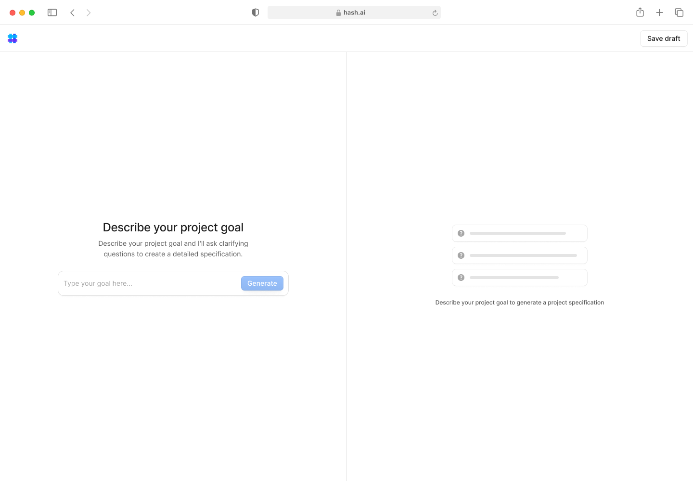
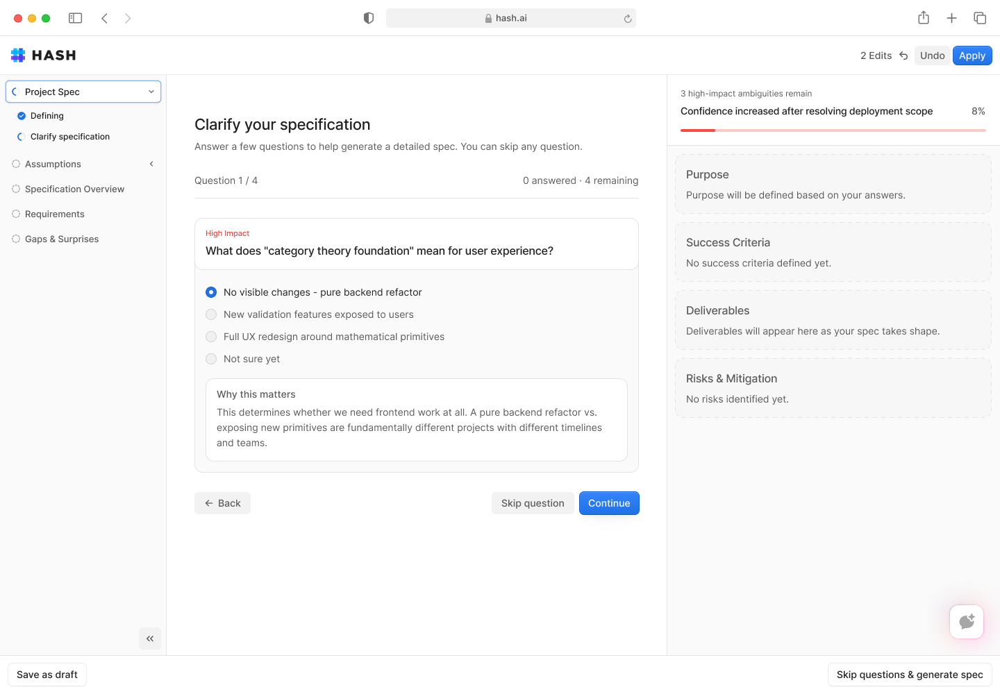
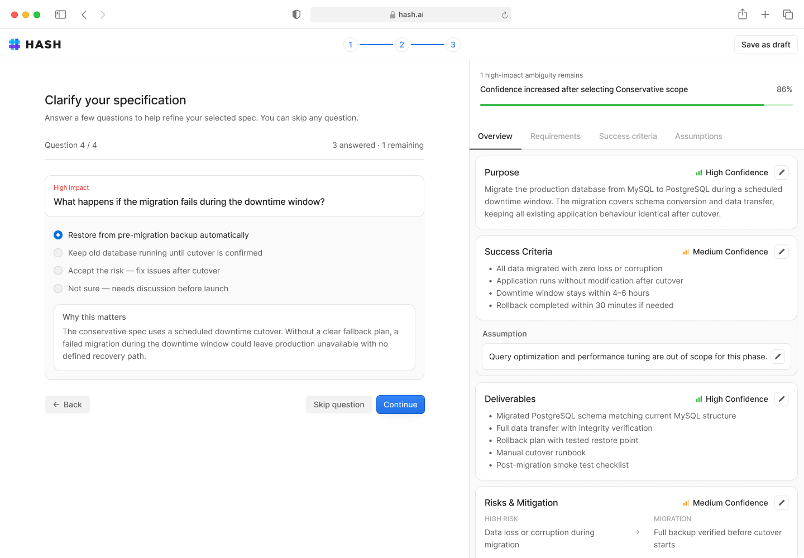
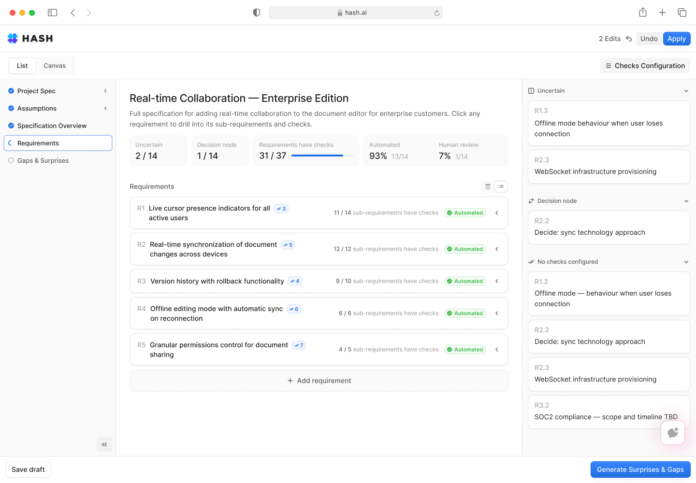
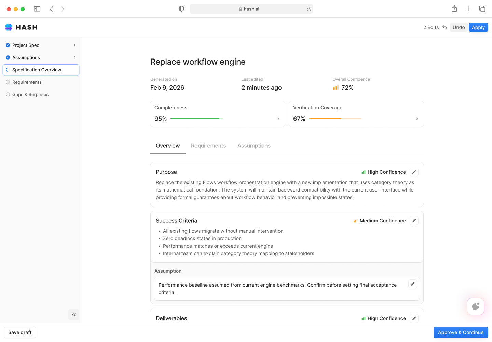

### MUST HAVES

- [ ] Exploring existing codebase as kickoff/framing input
- [x] Phase closure/hand-off "force"
- [ ] Output in a format that is ready for a coding assistant (e.g. files or whatever)
	- (need to get to the point where it can be experimented with as a way of working.)
- [ ] Make it look like the designs (ralph loop?)
	- maybe this is something you could kick off overnight one day, pointing Claude to some Figma screens?
- [ ] Stats/dashboard views for results
	- when generated, when last editited; title; version?
	- "completeness
	- verification coverage: how many of the requirements are covered by acceptance criteria w verifications
- [ ] "Scope" of such a spec must ultimately be more flexible -- we naively assume single project scope, and total/ultimate completion scope

### UI notes

LEFT SIDEBAR
- should list the phases, with an indicator of present position, and which are closed/open
- should capture the readiness and closeability
- as such, replaces the four items that have been placed in the header

RIGHT SIDEBAR
- should capture knowledge items either in a
	- sectioned list, or as
	- tagged items with some kind of button-toggle filter list at the top

NEW COMPONENTS: shadcn/ui coss-ui base-ui

- Progress
- Meter

## some early design sketches of the main flow (terminology and data model out of date; but UI style and layout relevant)

- the very beginning of a new project. The first image is the standard starting UI; below it is an alternate ideation, for the use-case where the kickoff is done by analyzing and harvesting from an existing codebase

  
- the first question of the first phase. a compact nav on left (alternate: across the top) indicates the phases; the wide sidebar on the right shows the (approximately) phase-based collection containers for the data we expect (the labels and terminology are wrong here). NOTE also that the question model is still wrong in these earlier designs, where the options provided are exclusive, and there is no free-text option. There is also the chance to "skip question" which I am dubious about, I would prefer the user explicitly why they are skipping (e.g. "i'm not sure enough about this yet"), as part of the free-text

  
- what the main interview roughly looks like, as it develops. the right sidebar is being filled in, so we are further along at thit point.

  
- a "review" style step, such as we've been imagining for the requirements and the (acceptance) criteria.  each of these might want to be expandable to show in more detail what the requirement is really about

  
- a sketch for what the final spec overview might look like

  

### "kickoff" (scope) phase needs two path variants

0. a "blank slate" (default path) will need a prompt informed by *shape-up framing*. this helps inform downstream interviewing
1. a "migrate/discover" type workflow where the agent reads from a workspace to grasp what the code is

### UI observations

- we have no waiting state when question cards are being formed
  - we need better understanding of which waiting states are in flight, locks, etc.
- there's some invisible interplay/locking going on between the interviewer and the observer I think — locks?
  - let's map this out and see if we can clarify it in the UI
  - let's also see if we can design the flow here, maybe we need a state machine
- the question-card pattern needs updating
  - put the "why" behing an hover-card / tooltip?
  - make the choices more compact; present them above the free-text area
  - do a combination checkbox group inside radios pattern? • [(A, B, C)], • [D: none] + textarea?
  - encouragement to explain why, what it relates to, any other accessory observations
