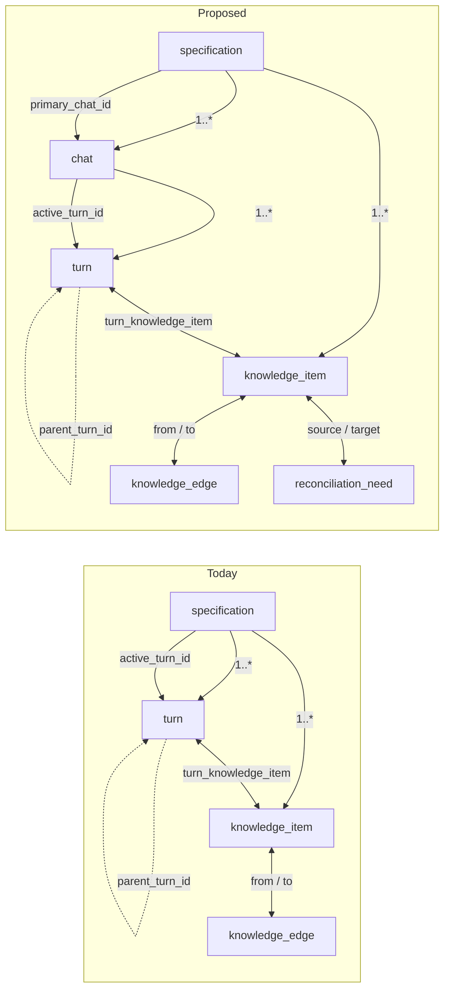

# Multi-Chat Substrate — Design Spec

> Output of brainstorm session 2026-05-05 with Lu. First phase of the larger intent-graph evolution now captured in `memory/SPEC.md` as the split between conversational turn history, current intent-graph truth, reconciliation needs, and future semantic changesets / patches. Substrate-only: data model, relationships, migrations. Reconciliation-agent loop, side-chat UI changes, and the full patch ledger are deliberately out of scope.
>
> Status: **proposed** — pending review before transitioning to an implementation plan.
>
> Relationship to side-chat design: this document supersedes older side-chat substrate assumptions. The side-chat UI may still stage proposed changes in an in-memory patch list, but durable multi-chat and reconciliation storage should follow this RFC rather than earlier patch/event-stream assumptions.

## 1. Concept & problem

Today every turn anchors directly to a `specification`, and a single linear turn chain *is* the spec's history spine:

- `turn.specification_id` is the only home for a turn.
- `turn.parent_turn_id` chains turns into one rope.
- `specification.active_turn_id` names the head of that rope.

This was correct when there was one interview thread per spec. It is no longer correct:

- **Side-chat** needs a parallel conversation surface anchored to graph items, not to the interview frontier. Early UI slices can ship this as an in-memory patch-list surface because the current durable substrate does not accommodate a second thread.
- **Direct user edits** from graph view (and, later, the architect loop) produce mutations that don't originate from any turn at all — they need a place to live and a way to advertise their downstream impact.
- **Reconciliation** of those mutations needs a typed signal: "this item changed, that item now needs confirmation". `knowledge_edge` carries semantic relations between items; it is the wrong place to record an open question between them.

This RFC introduces the smallest substrate change that unblocks both: a `chat` table that turns can relate to, and a `reconciliation_need` table that records directed open issues between graph targets.

It is **Phase 1** of the substrate evolution leading toward the patch ledger and ontology sharpening discussed in `memory/SPEC.md` decisions D134-D138. Subsequent substrate phases are listed in §10. Adjacent moves not part of this evolution — phase-route de-emphasis, typed patches with `prev_value` provenance, ontology additions (`invariant`, `example`) — are tracked separately.

### At a glance — the relational shift



Phase 1 adds two new tables (`chat`, `reconciliation_need`), a nullable `turn.chat_id`, a `specification.primary_chat_id`, and a mirrored `chat.active_turn_id`. Legacy `turn.specification_id` and `specification.active_turn_id` stay during the transition; the clean end state is still that turns belong canonically to chats and active turn heads live on chats.

## 2. Current model (annotated)

```
specification
  id
  name
  mode                'greenfield' | 'brownfield'
  active_turn_id      head of the single turn chain          ← mirrored to chat in Phase 1, later moves
  created_at, updated_at

turn
  id
  specification_id    every turn anchors here                ← retained in Phase 1, later replaced by chat_id
  parent_turn_id      chains turns
  phase               'grounding' | 'design' | 'requirements' | 'criteria'
  turn_kind           'question' | 'kickoff' | 'recovery'
  question, why, impact, answer, ...
  is_resolution
  user_parts, assistant_parts
  created_at

option
  id
  turn_id             1:N from turn                          (unchanged in V1; see §9)
  position, content, is_recommended, is_selected

phase_outcome
  id
  specification_id    spec-level                             (unchanged)
  phase
  proposal_turn_id    turns still own the moments
  confirmation_turn_id
  status, summary, closure_basis, confirmed_at, superseded_at
  created_at

knowledge_item
  id
  specification_id                                           (unchanged)
  kind                'goal' | 'term' | 'context' | 'constraint'
                    | 'decision' | 'assumption' | 'requirement' | 'criterion'
  subtype, content, rationale, kind_ordinal

turn_knowledge_item                                          (unchanged)
  turn_id, item_id
  relation            'captured' | 'confirmed' | 'edited'
                    | 'invalidated' | 'reviewed' | 'rejected'

knowledge_edge                                               (unchanged)
  from_item_id, to_item_id
  relation            'depends_on' | 'derived_from'
                    | 'constrains' | 'verifies' | 'refines'

annotation                                                   (unchanged)
  id, specification_id, knowledge_item_id
  summary, body, selection_start, selection_end, created_at
```

The fragility: `turn.specification_id` plus `specification.active_turn_id` plus `parent_turn_id` collectively encode "one rope per spec". Any new conversation surface bumps into this triple.

## 3. Proposed model — minimum changes

Two new tables, one new nullable FK, one mirrored active-head column, and one column added on spec. Names are placeholders; the conventions match the existing schema. Phase 1 is deliberately softer than the end state so the implementation can land without rewriting every spec-scoped query at once.

### 3.1 `chat` (new)

```ts
export const chat = sqliteTable(
  'chat',
  {
    id: integer().primaryKey({ autoIncrement: true }),
    specification_id: integer()
      .notNull()
      .references(() => specification.id),
    kind: text({ enum: ['interview', 'side_chat'] }).notNull(),
    active_turn_id: integer().references((): any => turn.id),
    created_at: text().notNull().default(sql`(datetime('now'))`),
  },
  (table) => [
    uniqueIndex('chat_interview_one_per_spec')
      .on(table.specification_id)
      .where(sql`kind = 'interview'`),
  ],
);
```

- `kind` distinguishes the canonical interview chat (one per spec, today) from side-chats (zero or more per spec). Future kinds (`architect`, `revisit`, …) extend this enum.
- `active_turn_id` moves off `specification` and onto `chat`. Each chat has its own head.
- A spec invariant emerges: every spec has exactly one `chat` with `kind = 'interview'`. The partial unique index enforces *at most one* interview chat per spec; spec creation and migration code enforce *at least one* by creating the spec and its interview chat in one transactional unit and setting `specification.primary_chat_id`.

### 3.2 `turn` (changed)

```ts
export const turn = sqliteTable('turn', {
  id: integer().primaryKey({ autoIncrement: true }),
  specification_id: integer()
    .notNull()
    .references(() => specification.id),          // retained during Phase 1
  chat_id: integer()                              // ← new Phase 1 pointer
    .references(() => chat.id),
  parent_turn_id: integer().references((): any => turn.id),
  phase: text({ enum: ['grounding', 'design', 'requirements', 'criteria'] }).notNull(),
  turn_kind: text({ enum: ['question', 'kickoff', 'recovery'] })
    .notNull()
    .default('question'),
  // ... rest unchanged
});
```

- `specification_id` stays during Phase 1 as compatibility and query convenience. New writes should also set `chat_id`, and application assertions keep `turn.specification_id === chat.specification_id`.
- The end state is that `specification_id` can be dropped and spec becomes reachable via `chat.specification_id`, but that is not required in the first slice.
- `phase` stays on turn. Per the second meeting: phase remains a background signal that shapes agent prompting; only the *UI primacy* of phase is being de-emphasised, and that's a separate RFC.
- `parent_turn_id` keeps its current semantics. It is still scoped to a single chat (parent and child must share `chat_id`); side-chat turns chain inside the side-chat, interview turns chain inside the interview chat.

### 3.3 `specification` (changed)

```ts
export const specification = sqliteTable('specification', {
  id: integer().primaryKey({ autoIncrement: true }),
  name: text().notNull(),
  mode: text('mode', { enum: ['greenfield', 'brownfield'] }).notNull().default('greenfield'),
  primary_chat_id: integer().references(() => chat.id),   // ← new
  active_turn_id: integer().references((): any => turn.id), // retained during Phase 1
  created_at: text().notNull().default(sql`(datetime('now'))`),
  updated_at: text().notNull().default(sql`(datetime('now'))`),
});
```

- `primary_chat_id` names the canonical interview chat. Today this is "the chat", tomorrow it's "the rope alongside which side-chats hang". Code that wants the interview frontier reads `specification → primary_chat_id → active_turn_id`.
- `active_turn_id` on the spec remains during Phase 1. Once read/write paths are stable through `primary_chat_id → active_turn_id`, the spec-level pointer can be dropped in a later cleanup migration.

### 3.4 `reconciliation_need` (new)

```ts
export const reconciliationNeed = sqliteTable(
  'reconciliation_need',
  {
    id: integer().primaryKey({ autoIncrement: true }),
    specification_id: integer()
      .notNull()
      .references(() => specification.id),
    source_item_id: integer()
      .notNull()
      .references(() => knowledgeItem.id, { onDelete: 'cascade' }),
    target_item_id: integer()
      .notNull()
      .references(() => knowledgeItem.id, { onDelete: 'cascade' }),
    kind: text({ enum: ['supersedes', 'needs_confirmation'] }).notNull(),
    status: text({ enum: ['open', 'resolved'] }).notNull().default('open'),
    reason: text(),
    caused_by_turn_id: integer().references(() => turn.id),
    caused_by_patch_id: integer(), // nullable placeholder until patch ledger exists
    created_at: text().notNull().default(sql`(datetime('now'))`),
    resolved_at: text(),
  },
  (table) => [
    // Multiple needs between the same items are allowed, but only one OPEN need
    // per (source, target, kind) — re-firing on an already-open issue is a no-op.
    uniqueIndex('reconciliation_need_open_unique')
      .on(table.source_item_id, table.target_item_id, table.kind)
      .where(sql`status = 'open'`),
  ],
);
```

- **Directional.** `source` is the item whose change *triggered* the issue; `target` is the item that may now need attention. The pair (`source`, `target`, `kind`) is the issue identity.
- **Spec-local.** `specification_id`, `source_item_id`, and `target_item_id` must all point into the same spec. SQLite only enforces the direct FKs shown above, so insertion and migration code must validate `source.specification_id = target.specification_id = reconciliation_edge.specification_id` before writing.
- **Kinds.** Two ship at Phase 1:
  - `supersedes` — the source change replaces or invalidates information the target depends on; target needs to be re-derived or marked stale.
  - `needs_confirmation` — the source change *might* affect target but the system can't decide deterministically; a human or agent has to look.
  - The enum is intentionally narrow. New kinds are added when we have a concrete reconciliation move that doesn't fit either; we don't pre-invent them.
- **Status lifecycle.** `open` on creation; `resolved` on agent / user action. Resolved edges are kept for audit but do not participate in the reconciliation queue.
- **Multiple needs per pair.** The unique index gates only `open` needs. Two successive edits to the same source can fire two `needs_confirmation` needs, the first being closed before the second is opened; what we forbid is *two simultaneously-open issues of the same kind for the same pair*.
- **Provenance.** Phase 1 carries `reason`, `caused_by_turn_id`, and nullable `caused_by_patch_id`. The turn pointer is useful immediately for observer / review-created needs; the patch pointer is a deliberate placeholder that stays null until the patch ledger gives every semantic mutation a stable id.

### 3.5 Everything else

`option`, `phase_outcome`, `knowledge_item`, `turn_knowledge_item`, `knowledge_edge`, `annotation` are **untouched**. Their relationships continue to work because turn ids remain stable across the migration; only what `turn` references upward changes. See §6.

## 4. Context model for new chats

Substrate-only note: this RFC does **not** specify the assembly logic, the prompt format, or who orchestrates it. It only specifies what data is reachable to a new chat at creation time.

A side-chat (or any non-interview chat) is created with:

- `chat.specification_id` — handle on the spec it lives in.
- `chat.kind` — distinguishes side-chat from interview.
- *No* link to a "parent" chat. Chats are siblings under a spec, not a tree.
- *No* automatic snapshot of the interview transcript. The data the side-chat consumes is the **current state of the spec**:
  - all `knowledge_item` rows for the spec,
  - all `knowledge_edge` rows between them,
  - all open `reconciliation_need` rows,
  - `phase_outcome` history (which phases are open / confirmed),
  - spec metadata (`name`, `mode`).

This is the second meeting's explicit decision: *new chats take in the current knowledge graph rather than previous conversation turns*. The interview transcript is provenance, not context.

How that gets formatted into a prompt and which agent owns the assembly is a follow-up RFC.

## 5. Reconciliation primitive

Substrate-only note: this RFC describes the **edge model and lifecycle**. The reconciliation agent (which reads the queue, decides severity, presents review sets) is a follow-up RFC.

### 5.1 Two production paths

```mermaid
flowchart TD
    M[Knowledge item changes<br/>(direct edit, patch apply,<br/>review acceptance)] --> P1[Path 1: deterministic]
    M --> P2[Path 2: observer pass]
    P1 --> KE[Look up existing<br/>knowledge_edges<br/>(depends_on, derived_from,<br/>constrains, refines, verifies)]
    KE --> RE1[Insert reconciliation_need<br/>per affected pair<br/>kind = 'supersedes' / 'needs_confirmation']
    P2 --> OB[Observer reads<br/>changed item + neighbourhood]
    OB --> NEW[Discovers new connection<br/>not previously in graph]
    NEW --> RE2[Insert reconciliation_need<br/>(may also insert new<br/>knowledge_edge)]

    classDef change fill:#fef3c7,stroke:#d97706
    classDef path fill:#dbeafe,stroke:#2563eb
    classDef out fill:#fed7aa,stroke:#ea580c
    class M change
    class P1,P2,KE,OB,NEW path
    class RE1,RE2 out
```

- **Path 1 (deterministic).** When an item changes, the system enumerates outgoing `knowledge_edge`s where it is the source (or incoming, depending on relation semantics — owned by the reconciliation agent's policy, not this RFC). For each, it opens a `reconciliation_need`. This is the only path Phase 1 needs to ship.
- **Path 2 (observer pass).** Asynchronous. The observer surveys the change in context of the current graph and may notice that two items now look related where they weren't before. It can insert both a new `knowledge_edge` (the discovered relation) and an `open` `reconciliation_need` (the issue raised by the discovery). This path is the one that handles the case from the meeting: *"now I'm rewriting the decision in a way that now sounds like I'm assuming the other decision as well"*. Substrate is ready for it; the observer prompt isn't.

### 5.2 Resolution

When the queue is resolved (by user, agent, or both), the matching `reconciliation_need` rows transition `open → resolved` and pick up a `resolved_at` timestamp. The actual resolution moves — accept a proposed change set, edit the target item, mark the issue irrelevant — produce knowledge-item mutations and (in time) patches. Those are not modelled here; they go through the same paths everything else does.

### 5.3 What this is *not*

- Not a workflow state. Reconciliation is a graph signal, not a phase. `phase_outcome` is the workflow state primitive and is unchanged.
- Not a patch. `reconciliation_need` records *that* an issue exists; it does not describe *what* should change. The proposed change is a separate artefact: today in-memory in the patch-list UI, durable in the patch ledger when it lands.
- Not an audit log of edits. `turn_knowledge_item` and (later) the patch ledger own that.

## 6. Migration

Drizzle / SQLite. One ordered migration, columns added before the dependent columns are dropped:

1. **0014_chat_table.sql**
   - Create `chat` table (id, specification_id, kind, active_turn_id nullable, created_at).
   - For each existing spec, insert one row: `kind = 'interview'`, `active_turn_id = specification.active_turn_id`.
2. **0015_turn_chat_id.sql**
   - Add `turn.chat_id` (nullable).
   - Backfill: for each turn, set `chat_id` to the interview chat of its current `specification_id`.
   - Make `chat.active_turn_id` `NOT NULL` for `kind = 'interview'` rows (handled in code; SQLite doesn't enforce partial NOT NULL).
3. **0016_specification_primary_chat.sql**
   - Add `specification.primary_chat_id`.
   - Backfill: for each spec, set `primary_chat_id` to the interview chat created in step 1.
4. **0017_reconciliation_need.sql**
   - Create `reconciliation_need` table with the partial unique index from §3.4.
   - Include `caused_by_turn_id` now and nullable `caused_by_patch_id` as a patch-ledger placeholder.

Code changes paired with migrations:

- Reads that need the interview head may move from `specification.active_turn_id` toward `specification → primary_chat_id → active_turn_id` incrementally.
- Writes that previously inserted a turn with `specification_id` now also insert with `chat_id` (the interview chat for the spec, or whichever chat the caller owns).
- Application assertions ensure `turn.specification_id === chat.specification_id` and `parent_turn_id` stays inside the same chat.
- Spec creation today inserts a spec; tomorrow it inserts a spec **and** an interview chat as one transactional unit. `bin/brunch new-spec` and the equivalent route handler are the only entry points.

Legacy cleanup is deferred:

The recreate-and-copy steps must preserve the FK graph, not just the column data. `turn.id` and `specification.id` stay stable while rebuilding the tables, and the replacement tables must recreate every surviving FK/index that references them (`turn.parent_turn_id`, `chat.active_turn_id`, `option.turn_id`, `phase_outcome.proposal_turn_id`, `phase_outcome.confirmation_turn_id`, `turn_knowledge_item.turn_id`, and `specification.primary_chat_id`). Each step runs inside a transaction with a pre/post `PRAGMA foreign_key_check` so transient FK breakage is caught before the migration commits.

No data loss. Every existing turn lands inside the interview chat of its spec; every existing `specification.active_turn_id` becomes the interview chat's `active_turn_id`. `phase_outcome`, `option`, `knowledge_item`, `turn_knowledge_item`, `knowledge_edge`, `annotation` are untouched.

## 7. Out of scope (acknowledged adjacents)

- **Patch ledger.** Typed semantic patches with `prev_value` / `value` and explicit provenance, replacing the in-memory patch-list model. This RFC creates room for the ledger by separating chat from spec, but does not introduce the ledger itself.
- **Phase routes / phase as primary UI concept.** The second meeting agreed phase should de-emphasise as UI but stay as a background signal for prompting. UI work is its own RFC; the data model here keeps `turn.phase` exactly as-is.
- **Ontology sharpening (`invariant`, `example` as `knowledge_item.kind`).** Discussed in `memory/SPEC.md` D134 and D136. Pure ontology change; no impact on the chat / reconciliation substrate.
- **Decision shape rework.** The meeting concluded a decision should capture both *chosen* and *not chosen*, and that the `option` table can probably go away in favour of in-turn data. Both moves belong with the patch-ledger work; today's `option` table stays.
- **Phase outcome enum redesign.** The meeting flagged the `proposed | confirmed | superseded` enum as "find a better idea". Out of scope; `phase_outcome` is unchanged.
- **Reconciliation agent loop.** Who reads `reconciliation_need` rows, in what order, how it presents review sets. Substrate is ready; the agent design is a separate RFC.
- **Side-chat UI changes for multi-thread.** Today may ship a single side-chat-per-spec through an in-memory patch-list surface; the `chat` table accommodates many but the UI can continue to render one until persistent side-chat UX catches up. User-surface version labels from older UI design docs are independent of substrate Phase 1 / 2 / 3 / 4 — see §10 for the mapping.

## 8. Verification stance

Substrate change. Coverage is migration-and-FK shaped, not user-flow shaped:

| Loop | Coverage |
|---|---|
| **Schema migration tests** | Forward migration produces one `chat` per spec; every existing turn has a matching `chat_id`; every spec has a matching `primary_chat_id`; chat's `active_turn_id` matches old spec's. Idempotent on re-run. |
| **FK integrity tests** | Inserting a turn with a `chat_id` whose chat belongs to a different spec is rejected at the application layer (DB enforces only direct FK). Parent / child turns must share `chat_id` (application-layer assertion). SQLite table-recreate migrations preserve and revalidate all surviving turn/spec FKs. |
| **Reconciliation lifecycle tests** | Opening a duplicate `(source, target, kind)` while one is `open` is rejected. Resolving and re-opening with the same triple is allowed. Cross-spec source/target pairs are rejected at the application layer. Cascade-delete on `knowledge_item.id` removes both knowledge edges and reconciliation edges. |
| **Read-path regression** | `specification → primary_chat_id → active_turn_id` returns the same turn id that `specification.active_turn_id` did pre-migration on a fixture set. Legacy spec-head reads and new chat-head reads agree during transition. |
| **Existing turn-knowledge-item provenance** | Survives migration unchanged. Every `turn_knowledge_item` row continues to point to a valid turn. |

Manual: spin up an existing spec database (a current `.brunch/` fixture), run migrations, exercise the existing interview flow, confirm no behavioural change.

## 9. Open questions

- **`turn.specification_id` retention.** Phase 1 keeps it. The end-state cleanup should drop it unless profiling proves the denormalized field pays for itself.
- **Side-chat `chat.parent_turn_id` or anchor item.** A side-chat is started *from* a graph item. Should the `chat` row record the anchor item id? Default proposal: don't model it on `chat`; use a later `chat_focus` table when durable focus is wanted.
- **Reconciliation `reason` shape.** Free text in V1. Once the reconciliation agent ships, `reason` may want to be structured (template id + slots). Default proposal: stay free-text until the agent design forces a shape.
- **Reconciliation cascade-on-resolve.** When a `supersedes` need resolves, does that ever fan out into new reconciliation needs (because the resolution itself is a mutation)? Yes — and that is exactly the reentrancy point Lu flagged in the second meeting. Substrate already handles it: any mutation re-runs path 1 + path 2. The agent decides whether to bundle resolution into one review set or accept a follow-up cycle. No substrate change needed.
- **`option` table fate.** Meeting tentatively concluded the table can go away in favour of in-turn data. Out of scope here; tracked alongside the patch-ledger / decision-shape work.
- **`phase_outcome` enum redesign.** Tracked alongside the de-emphasise-phase-as-UI RFC.
- **Multiple `reconciliation_need.kind`s for one pair.** The partial unique index gates only same-kind same-direction. A single source change could legitimately produce both `supersedes` *and* `needs_confirmation` against the same target; allowed by design. Confirm this is intended.

## 10. Phasing

`Phase N` labels here describe the *substrate* evolution and are independent of any V1 / V2 / V3 / V4 labels used for the *user surface*. The `Enables` column maps between them where they connect.

| Phase | Substrate state | Enables (user-surface mapping) |
|---|---|---|
| **Phase 1** *(this RFC)* | `chat` table; nullable `turn.chat_id`; `specification.primary_chat_id`; mirrored `chat.active_turn_id`; `reconciliation_need` table with lightweight provenance placeholders. Backfill migrations. New writes populate both legacy and chat pointers. No user-visible change: still one chat per spec, still one rope per chat, side-chat can continue to use an in-memory patch-list surface. | Foundation. Existing side-chat / graph-edit surfaces can ship against today's mutation paths regardless of order. Hard-edit cascade gets a clean reshape once it reads from `reconciliation_need` rather than ad-hoc REVISIT state. Persistent multi-thread side-chat and the architect loop become shippable without waiting on the full patch ledger. |
| **Phase 2** | Side-chat persistence: side-chat threads write `chat` rows with `kind = 'side_chat'` and persist their turns. Multiple side-chats per spec become possible at the data layer. | Persistent side-chat history and old-thread UI can activate. |
| **Phase 3** | Reconciliation agent loop reads `reconciliation_need` queue, presents review sets through the same patch list as the side-chat. | Side-chat V3 hard-edit cascade ships against the reconciliation agent (replaces the REVISIT modal). Architect loop's review surface inherits the same machinery. |
| **Phase 4** *(later)* | Patch ledger lands. `reconciliation_need.caused_by_patch_id` becomes populated for patch-caused needs. Decision-shape rework, option-table removal, and phase-outcome enum redesign happen here. | Architect loop's typed-patch version. Item versioning. Cross-surface undo / time-travel. |

## 11. Traceability

- **Replaces** the implicit "one rope per spec" assumption baked into `turn.specification_id` and `specification.active_turn_id`.
- **Unblocks** the patch ledger, the architect / generator loop horizon item, and persistent multi-chat side-chat history.
- **Bounded by** D113 (no second durable workflow model — `chat` is *not* workflow state, it is a conversation-thread substrate; workflow state stays on `phase_outcome`).
- **Reuses** existing `knowledge_item`, `knowledge_edge`, `turn_knowledge_item`, `option`, `phase_outcome`, `annotation` schemas as-is.
- **References** `memory/SPEC.md` decisions D135, D137, and D138 plus `docs/design/PATCH_LEDGER.md` for the deeper semantic mutation ledger. Supersedes older side-chat substrate assumptions while remaining compatible with the user-facing side-chat surface.
