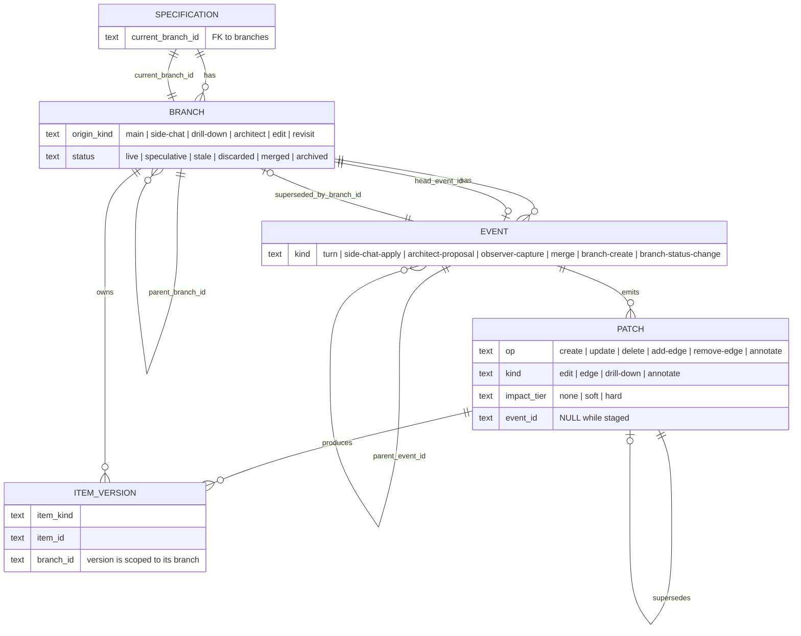
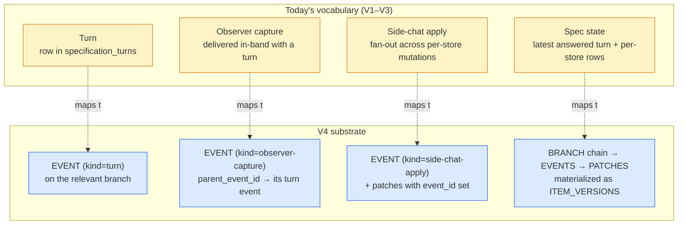
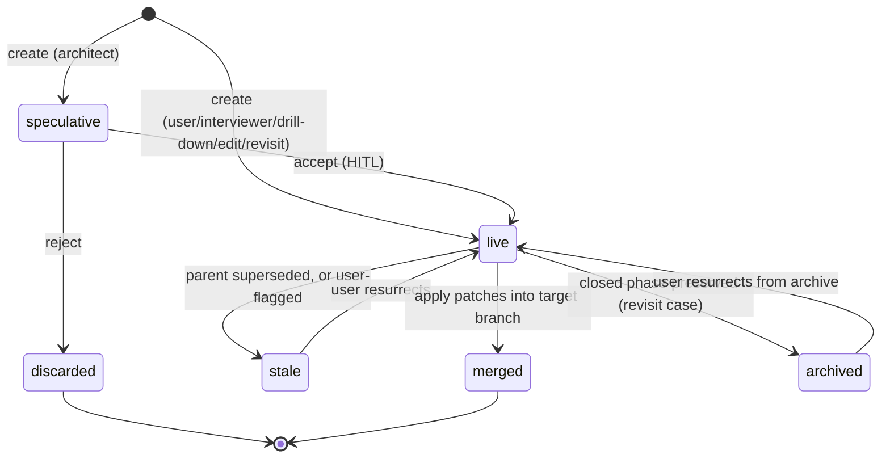

# Patch / Event-Stream Data Model

> Output of brainstorm session 2026-05-01. Concretizes assumptions A71 (patch / event-stream model), A72 (item versioning), and A73 (architect loop) from `memory/SPEC.md` into a proposed data structure for branched turns, patch-staged mutations, and event-driven projections.
>
> Status: **proposed (future-facing)** — this is the north-star data model behind side-chat V4 and the architect loop. V1 / V2 / V3 ship on the current store-of-stores; this design describes the substrate they migrate onto in V4. Pending review before transitioning to an implementation plan.
>
> Canonicality: `memory/SPEC.md` and `memory/PLAN.md` remain authoritative for what's true now and what's next. This is a focused design note for one specific data-model evolution and does not by itself reorder the live frontier.

## TL;DR

**The problem.** Today, Brunch saves spec edits by directly mutating per-kind tables (one for requirements, one for criteria, etc.). That works for one linear interview, but it breaks down for: side-chat patches that need to *stage* before applying, an architect agent proposing changes for review, item history, and any kind of branching ("what if we'd answered differently here?").

**The idea.** Replace direct mutation with four concepts:

1. **Branches** — every line of conversation is a named branch with a status (`live`, `speculative`, `stale`, etc.). The interview lives on `main`; side-chats, drill-downs, edits, architect proposals all become branches. Stale branches get filtered out of view but stay in the database — recoverable.
2. **Events** — an append-only log of everything that happens (turns, applies, proposals, merges). The log is the truth.
3. **Patches** — individual proposed changes (rename this, add that edge). Patches can be staged (sitting in the side-chat patch list) or applied (linked to an event). The architect produces patches the same way the user does — one review surface for both.
4. **Item versions** — a cache that says "what does requirement C1 look like on branch X right now?" so reads don't have to replay history. If the cache breaks, rebuild from the event log.

**Branching, the short version.**

- **Side-chat?** It's a branch. Apply = merge it into main.
- **Drill-down?** Branch. Both stay live forever (or until you merge).
- **Architect proposes 3 changes?** Each proposal is a speculative branch. Accept = merge. Reject = discard.
- **User edits an old answer?** Fork from that point; the original "what would have happened" chain is hidden but recoverable.
- **Revisit a closed phase?** Same as edit, but the original is "archived" instead of "stale" (just a UI tag).

**When does this ship?** Not in V1, V2, or V3 of side-chat — those still use today's stores. **V4** is the swap. The earlier versions are designed *as if* this substrate already existed, so V4 is a substrate change rather than a redesign.

**What this changes in `SPEC.md`.**

- D80 ("no turn branching") gets relaxed: branching is fine, but only via tracked `Branch` entities with a stated reason — no chaos.
- D113 ("one durable workflow model") still holds, just at the event-log layer instead of the per-store layer.
- A71, A72, A73 (patch model, item versioning, architect loop) graduate from "low-confidence future" assumptions to real decisions when V4 ships.

**The one rule to remember.** The event log is the truth; everything else is a cache. If the cache disagrees with the log, the cache is wrong. That's what makes audit, recovery, and migration tractable.

## 1. Why this exists

Today, Brunch persists durable spec state through a "store-of-stores" pattern: per-kind tables for items (requirements, criteria, decisions, etc.), edges, comments, observer captures, all mutated through per-kind mutation calls. Turns are linear (D80: "no turn-tree branching"); durable truth is "the most recently answered turn plus per-store rows."

This shape works for a single linear interview but creates friction around four near-future asks:

- **Side-chat patches** (live in `docs/design/SIDE_CHAT.md`) need to *stage* before they apply. Today's stores have no concept of "proposed mutation"; the patch list lives in client memory and translates to per-store calls only at apply time.
- **Architect / generator patches** (A73) — the system speculatively producing patches for HITL review — need the same staging concept at higher volume and with provenance ("which proposal produced this patch").
- **Item versioning** (A72) — needed for span-anchored annotations to survive item edits, soft-edit audit trails, and revisit cascades that should produce new versions rather than invalidate old rows.
- **Branched exploration** — drill-downs, edits to past turns, revisits of closed phases all want to *coexist* with the original chain rather than overwrite it.

A71 in `memory/SPEC.md` names the target shape: *"a unified `spec → chat → turns` data model with diff-shaped patches as the persistence primitive."* This document concretizes that target into a specific data structure.

## 2. Decisions snapshot

Made during the brainstorm session 2026-05-01.

| Decision | Choice | Rationale |
|---|---|---|
| **Branching ambition** | Lift D80 — turns can branch (turn-tree DAG) | Drill-down, edits, revisits, architect proposals all want true branching |
| **Substrate shape** | **Approach 2:** event log + first-class `Branch` entities (vs. pure event-DAG with implicit branches, or patch-only DAG dropping turns) | Branches need UI handles, lifecycle metadata, and per-`originKind` policy; an implicit-branch model makes branch-as-concept ad-hoc |
| **Trigger set** | (i) edit past turn, (iii) side-chat apply, (iv) drill-down, (v) architect, (vi) revisit closed phase | (ii) bare "fork this thread" not needed; all branches are intent-driven |
| **Status taxonomy** | `live` · `speculative` · `stale` · `discarded` · `merged` · `archived` | Stale-recoverable + discard-permanent + speculative pre-review + archived for closed-phase audit |
| **Side-chat shape** | (α) Side-chat session is itself a branch; apply = merge to main | Conversation persists; multi-thread V4 = N side-chat branches |
| **Edit semantics** | (γ) Auto-stale original downstream from the edit point; recoverable via status flip | Clean default; user can resurrect with one click |
| **Materialization** | **M3 + M3c:** event log is durable truth; per-`(item_id, branch_id)` index serves as the read cache | Reads are direct lookups; bugs are recoverable by `DROP cache; REBUILD` from the log |
| **Patch granularity** | **P3:** events are coarse units; patches are first-class rows linked to events | Preserves D113 turn-as-unit at the event layer; gives A71 the addressability it needs |

## 3. Core entities

Four tables. Read this section as a sketch, not a final schema — column types and FKs will tighten during implementation; the relationships and invariants are what matters.

### 3.1 `branches`

A branch is a named line of conversation/exploration with explicit lifecycle metadata.

```
branches (
  id                  text PK
  spec_id             text FK
  parent_branch_id    text FK NULL          -- NULL only for main
  origin_event_id     text FK NULL          -- the event in parent_branch where the fork happened
  head_event_id       text FK NULL          -- latest event on this branch (NULL until first event)
  status              text                  -- live | speculative | stale | discarded | merged | archived
  origin_kind         text                  -- main | side-chat | drill-down | architect | edit | revisit
  label               text                  -- user-visible name; default derived from origin_kind + ts
  created_at          ts
  created_by          text                  -- user | interviewer | architect | system
  status_changed_at   ts NULL
  status_changed_by   text NULL
)
```

Invariants:

- Exactly one branch per spec has `origin_kind = 'main'` and `parent_branch_id = NULL`.
- All other branches have non-null `parent_branch_id` and `origin_event_id`.
- A branch's lineage is the chain `branch → parent_branch → ... → main`.
- A spec's `current_branch_id` (on `specifications`) names the branch graph view defaults to.

### 3.2 `events`

Append-only durable log. Every meaningful state-changing operation produces an event.

```
events (
  id                       text PK
  branch_id                text FK
  parent_event_id          text FK NULL     -- previous event on same branch; NULL for first event on a branch
  kind                     text             -- see kinds below
  payload                  json             -- kind-specific
  superseded_by_branch_id  text FK NULL     -- set when a sibling branch supersedes this event (edit/revisit case)
  created_at               ts
  created_by               text             -- user | interviewer | observer | architect | system
)
```

**Event kinds:**

| Kind | Meaning | Carries |
|---|---|---|
| `turn` | A normal interview turn (question + answer pair) | prompt, response, intent |
| `side-chat-apply` | User applied a side-chat patch list onto a target branch | merged-patch IDs, source side-chat branch ID |
| `architect-proposal` | Architect generated N candidate patches | proposal context, model used |
| `observer-capture` | Observer extracted entities post-turn | capture metadata, source-turn event ID |
| `branch-create` | A new branch was forked | origin event, origin kind, rationale |
| `branch-status-change` | Branch status flipped (e.g. stale → live, speculative → merged) | from-status, to-status, reason |
| `merge` | Generic merge of patches from another branch | source branch ID, merged patch IDs |

D113 invariant remains: a `turn` event is the unit of durable mutation for the interview proper. The other kinds are explicitly *not* turns — they don't advance the interview itself, even though they may emit patches that change spec state.

### 3.3 `patches`

A first-class row per individual mutation. One event can have N patches.

```
patches (
  id            text PK
  event_id      text FK NULL                -- NULL while staged; NOT NULL after apply
  branch_id     text FK                     -- branch where staged (= side-chat branch for side-chat patches)
  op            text                        -- create | update | delete | add-edge | remove-edge | annotate
  item_kind     text
  item_id       text NULL                   -- NULL on create until item id assigned
  before        json NULL                   -- snapshot for undo/audit (NULL on create)
  after         json NULL                   -- proposed new value (NULL on delete)
  supersedes    text FK NULL                -- prior staged patch this one replaces within the same staging list
  kind          text                        -- edit | edge | drill-down | annotate (the user-facing patch kind from SIDE_CHAT.md §3)
  impact_tier   text NULL                   -- none | soft | hard (refined at apply time)
  meta          json                        -- selectionRange, summary, etc.
  created_at    ts
)
```

Patches with `event_id = NULL` are **staged**. The side-chat patch list is just `WHERE branch_id = sideChatBranchId AND event_id IS NULL`.

Two stability rules govern the FK columns:

- **`branch_id` is set at creation and never moves.** It records *where the patch was first staged*, not *which branch it's been applied to*. Membership of a merged patch in a target branch's view is computed via the merge event's lineage in payload, not by mutating `branch_id`.
- **`event_id` is set when the patch is first associated with a durable event and never moves after.** For side-chat patches, that's at apply (the `side-chat-apply` event becomes their `event_id`). For architect patches, that's at creation (the `architect-proposal` event is their `event_id`). When a `merge` event later references a patch by ID in its payload, it does *not* re-set the patch's `event_id` — the patch is still "introduced by" its original event.

### 3.4 `item_versions`

The M3c read cache. One row per (item, branch-where-the-version-was-created).

```
item_versions (
  id                text PK
  item_kind         text
  item_id           text
  branch_id         text FK                 -- branch on which this version was created
  source_patch_id   text FK
  value             json                    -- fully materialized item state at this version
  supersedes        text FK NULL            -- prior version on the same branch lineage
  created_at        ts
)
```

Read query — *"show item X on branch B"* — selects the latest version reachable from B's lineage, filtered to live/speculative branches:

```sql
SELECT iv.*
FROM item_versions iv
JOIN branches b ON b.id = iv.branch_id
WHERE iv.item_id = $itemId
  AND iv.branch_id IN ($lineage_of_B)
  AND b.status IN ('live', 'speculative')
ORDER BY iv.created_at DESC
LIMIT 1
```

`lineage_of(B)` = `B, parent(B), parent(parent(B)), ..., main`.

If the cache is missing or invalidated, **rebuild = replay all events in lineage order, applying patches in order to compute the latest version per item.** The event log is always the durable truth; `item_versions` is reconstructible from it.

### 3.5 Entity-relationship overview

The four core entities, their relationships, and the key enums on each.



### 3.6 Where today's vocabulary lands

The diagram above introduces three layers of taxonomy that didn't exist in the V1–V3 vocabulary. Today's terms map onto the new substrate as follows.



**The one-line shift.** *Old:* "turn = unit of durable mutation." *New:* "event = unit of durable mutation; `kind='turn'` is one event kind among seven."

**What stays the same.** Every existing API verb and identifier — `submitTurnResponse`, `prepare/resolve/finalize turn flow`, `revision card stacked on a question card`, `turnId`, `turn-response`, `turn-artifacts` — keeps its meaning. In V4 they all operate on events with `kind='turn'`; the terminology shift is at the substrate layer, not at the orchestration layer.

**What's new in V4 that has no V1–V3 analogue.** Branches as first-class entities with lifecycle metadata, events of `kind ∈ {architect-proposal, merge, branch-create, branch-status-change}`, staged patches (patches with `event_id = NULL`), item versions. Side-chat sessions and architect proposals both materialize as branches — these have no equivalent record today.

**D80 / D113 in this picture.** D80's "no turn-tree branching" relaxes one level: turn events on the same branch still form a linear chain, but multiple branches can each carry their own chain (the tree lives at the branch layer, not inside a single branch's event chain). D113's "one durable workflow model" reaffirms at the event-log layer — there's one event log per spec, with `kind='turn'` events tracking the interview workflow specifically.

## 4. Branch lifecycle

### 4.1 Status state machine



`stale` is **recoverable**: filtered out of normal views, but a user can flip the status back to `live` and the branch's events return to the cache. `discarded` is permanent (the row stays for audit, but no UI affords resurrection). `archived` is `stale`'s twin for closed-phase preservation — same filter behavior, but tagged distinctly so audit views can scope to "archived closes" specifically.

### 4.2 Lifecycle policy per `origin_kind`

The `origin_kind` of a new branch determines its default starting status, what happens to its parent and siblings, and what the default `Apply / Resolve` action is.

| Origin kind | Default starting status | Parent / sibling fate at fork | Default Apply / Resolve |
|---|---|---|---|
| `side-chat` (iii) | `live` | parent stays `live` — side-chat is a parallel exploration | Apply = `side-chat-apply` event on parent; side-chat branch → `merged`. Discard = side-chat → `discarded`. |
| `drill-down` (iv) | `live` | parent stays `live` — both live indefinitely (designed-in coexistence) | No auto-merge. Drill-down can later merge back via explicit action, or stay as a sibling sub-spec. |
| `architect` (v) | `speculative` | parent untouched | Accept = `merge` event on parent; architect branch → `merged`. Reject = `discarded`. Multiple speculative siblings can coexist for compare. |
| `edit` (i) | `live` | original downstream-of-fork on parent → `superseded_by_branch_id` set; events filtered from default views, recoverable via status flip | None (live merges happen organically as turns continue on the edit branch). User can resurrect superseded events to restore the original chain. |
| `revisit` (vi) | `live` | original closed-phase chain → `archived` (events filtered from default views; preserved for audit) | Same as edit: resurrect by status flip. |

### 4.3 The supersession mechanism (edit and revisit)

Edit and revisit both fork from a point in the parent branch and want to *replace* the parent's chain past that point rather than coexist with it. The mechanism is `events.superseded_by_branch_id`:

```
1. Insert the new branch (origin_event_id = T).
2. For all events on the parent branch with parent_event_id chain past T,
   UPDATE events SET superseded_by_branch_id = newBranchId.
3. Set specifications.current_branch_id → newBranchId
   (graph view defaults to the new fork; user can switch back).
```

Materialization filters out events where `superseded_by_branch_id IS NOT NULL` and the superseding branch's `status IN ('live', 'speculative')`. If the superseding branch is later `discarded`, supersession is lifted automatically (the original events become visible again). If the user resurrects the original chain manually (e.g., "actually keep both, I'll merge them later"), supersession can be cleared by setting `superseded_by_branch_id = NULL` and the original chain's events return to view alongside the edit branch — turning the edit into a drill-down-shaped coexistence.

This is why `stale` is a recoverable state: every "stale" effect in this model is a reversible filter, never a destructive update.

## 5. Materialization

### 5.1 Truth vs. cache

- **Durable truth:** `branches`, `events`, `patches`. These tables are the only source of truth.
- **Cache:** `item_versions`, plus any denormalized read-side projections (e.g., per-branch active-path arrays, edge adjacency lists). These are reconstructible from the durable truth.

The discipline: **the log is always right.** If `item_versions` and the event log disagree, the cache is wrong. `DROP cache; REBUILD` from the event log is always safe and produces correct state.

### 5.2 When the cache rebuilds

| Trigger | Rebuild scope | Notes |
|---|---|---|
| `apply` of a side-chat patch list | Affected items on target branch only | New `item_versions` rows inserted; other items untouched |
| `architect-proposal` accepted (full or partial) | Affected items on target branch only | Same shape as side-chat-apply |
| Branch status flip (e.g. `stale` → `live`) | Items modified on the flipped branch | Latest-version SQL re-evaluates; new version winner shown |
| Branch deleted (truly gone — out of scope for V4) | Affected items on parent branch | Not in V4 scope; left as a future operation |
| Cache corruption / schema migration | Full rebuild from log | Acceptable to do in a maintenance window; replay is bounded |

### 5.3 Why M3c (per-`(item_id, branch_id)` index) over alternatives

- **M1 (pure event replay):** every read folds the entire event chain. Acceptable for short specs, painful at hundreds of turns × thousands of patches. M3c stores the fold result and makes reads a single SQL query.
- **M2 (full materialized state per branch):** stores complete denormalized item graph per branch. Disk cost ≈ N branches × spec size; stale flips are expensive to reflect. Overkill for a local-first SQLite product.
- **M3a (full cache per branch as in M2 but explicitly cache-vs-truth):** same disk cost as M2; complexity not earned in V4.
- **M3b (canonical cache for main + per-branch deltas):** more complex than M3c with no clear win for our scale.
- **M3c (chosen):** one row per `(item_id, branch_id)` version; SQL filter on lineage + branch status. Cheap disk, fast reads, simple semantics.

## 6. The main branch and canonical view

### 6.1 `main` always exists

Every spec has exactly one `main` branch, created at spec creation. `parent_branch_id = NULL`, `origin_kind = 'main'`. All other branches are descendants (directly or transitively) of `main`.

### 6.2 Default view

`specifications.current_branch_id` points to whichever branch the spec considers "primary" for display purposes. The graph view, observer pipeline, and export all read this column to decide what to show by default.

| Action | Effect on `current_branch_id` |
|---|---|
| Spec created | `current_branch_id = main` |
| Side-chat session opens | unchanged (side-chat is a parallel exploration, picker shows it as a parallel tab) |
| Drill-down forks | unchanged (drill-down is a sibling; user picks via picker) |
| Architect proposes | unchanged (speculative branches surface in a Proposals tray, not as the default view) |
| Edit forks | moves to the edit branch (the user has explicitly chosen the new chain) |
| Revisit forks | moves to the revisit branch |
| Architect proposal accepted | unchanged (the merge lands on the previous current; current stays put) |
| User flips it manually via the branch picker | moves to the user's choice |

The branch picker (planned UI surface, not in V1) lists all `live` and `speculative` branches grouped by `origin_kind`. `stale`/`archived`/`discarded` branches are filterable on demand.

### 6.3 Coexistence vs. supersession

Two distinct relationships between sibling branches:

- **Coexistence** (drill-down, side-chat sessions, architect speculations): both siblings stay live; user picks which to view via the picker. No event is superseded.
- **Supersession** (edit, revisit): original parent-branch events past the fork point are flagged `superseded_by_branch_id` and filtered from default views. Recoverable by clearing the flag.

Coexistence is the default. Supersession is opted into by trigger type.

## 7. Worked examples

Five walkthroughs, one per origin kind. Pseudo-SQL is illustrative.

### 7.1 Side-chat apply (origin `side-chat`)

```
1. User opens side-chat from C1 in graph view.
   INSERT branches (origin_kind='side-chat', parent=main, status='live',
                    origin_event=main.head_event_id, label='Chat about C1')
   INSERT events  (branch=sideChatBranch, kind='branch-create')
   UPDATE branches SET head_event_id=newEventId WHERE id=sideChatBranch

2. User chats. Each exchange = a turn-shaped event on the side-chat branch.
   INSERT events (branch=sideChatBranch, kind='turn', payload={prompt, response})

3. The chat surfaces a patch proposal: "rename household → family in C1".
   INSERT patches (event_id=NULL, branch=sideChatBranch, op='update',
                   item='C1', kind='edit', impact_tier='soft', after={...})

4. Top-bar shows "1 Edit · Apply".

5. User clicks Apply.
   INSERT events (branch=main, kind='side-chat-apply', parent=main.head_event_id,
                  payload={mergedPatchIds: [P1], sourceBranchId: sideChatBranch})
   UPDATE patches SET event_id=newApplyEventId
                  WHERE branch=sideChatBranch AND event_id IS NULL
   UPDATE branches SET status='merged' WHERE id=sideChatBranch
   UPDATE branches SET head_event_id=newApplyEventId WHERE id=main
   INSERT item_versions (item_id='C1', branch=main, source_patch=P1, value={...})

6. Graph view re-renders main; C1 shows the new value.
```

### 7.2 Drill-down (origin `drill-down`)

```
1. User clicks "deepen this area" intent on C2 in graph view.
   INSERT branches (origin_kind='drill-down', parent=main, status='live',
                    origin_event=main.head_event_id, label='Deepen C2')
   INSERT events  (branch=drillBranch, kind='branch-create')

2. Subsequent interview turns land on the drill-down branch (current_branch_id
   does NOT move; user can switch via picker).

3. Both main and drill-down stay live concurrently.
   Branch picker surfaces "main · Deepen C2".

4. Eventual outcomes:
   a. Merge drill-down → main: INSERT events (branch=main, kind='merge',
      payload={sourceBranchId: drillBranch, mergedPatchIds: [...]});
      drill-down → 'merged'.
   b. Leave as long-running sibling: no further action; both stay live forever.
```

### 7.3 Architect proposal (origin `architect`)

```
1. Architect agent runs against main, produces 3 candidate patches against C5.
   INSERT branches (origin_kind='architect', parent=main, status='speculative',
                    label='Tighten ambiguity in C5')
   INSERT events  (branch=archBranch, kind='architect-proposal',
                   payload={modelUsed, proposalContext})
   INSERT patches × 3 (event_id=proposalEventId, branch=archBranch)

2. Top-bar "Proposals" tray surfaces the 3 patches.

3. User reviews:

   a. Accept all → INSERT events (branch=main, kind='merge',
      payload={sourceBranchId: archBranch, mergedPatchIds: [P1, P2, P3]});
      patches.event_id stays as proposalEventId (the event that introduced them);
      the merge event's payload references them by ID. INSERT item_versions × 3
      on main for the affected items. UPDATE branches SET status='merged'
      WHERE id=archBranch.

   b. Accept 1, reject 2 → INSERT events (branch=main, kind='merge',
      payload={sourceBranchId: archBranch, mergedPatchIds: [P1],
               rejectedPatchIds: [P2, P3]});
      INSERT item_versions × 1 on main. UPDATE branches SET status='merged'
      WHERE id=archBranch (with partial merge recorded in payload audit).
      Alternative shape considered: split archBranch into accepted/rejected
      sub-branches — rejected as overkill for V4.

   c. Reject all → UPDATE branches SET status='discarded' WHERE id=archBranch.
```

### 7.4 Edit a past turn (origin `edit`)

```
1. User scrolls back, clicks "edit" on turn T (10 turns ago) on main.
   Let postT = events on main with parent chain leading from T forward.

   INSERT branches (origin_kind='edit', parent=main, status='live',
                    origin_event=T, label='Edit answer at T')
   INSERT events  (branch=editBranch, kind='branch-create')
   UPDATE events  SET superseded_by_branch_id=editBranch
                  WHERE id IN postT
   UPDATE specifications SET current_branch_id=editBranch

2. The user re-answers at T on the edit branch.
   INSERT events (branch=editBranch, parent=T, kind='turn',
                  payload={prompt=T.prompt, response=newAnswer})

3. Subsequent turns continue on editBranch as new live chain.

4. Graph view defaults to editBranch (current_branch_id moved).
   The original main postT chain is still in the log but filtered out
   by materialization (because superseded_by_branch_id is set and editBranch is live).

5. If the user later resurrects the original:
   UPDATE events SET superseded_by_branch_id=NULL WHERE was previously superseded
   UPDATE branches SET status='stale' WHERE id=editBranch
   (or both branches live in coexistence if the user prefers — depends on UI choice).
```

### 7.5 Revisit a closed phase (origin `revisit`)

Structurally identical to edit, but the original chain transitions through `archived` (filtered out by default with a distinct UI tag) rather than via supersession.

```
1. User invokes "revisit grounding" on a closed-phase chain ending at event Z.
   INSERT branches (origin_kind='revisit', parent=main, status='live',
                    origin_event=Z, label='Revisit grounding')
   UPDATE events  SET superseded_by_branch_id=revisitBranch
                  WHERE on main and downstream of Z
                  AND were part of the closed phase
   -- alternatively: set events.superseded_by_branch_id but tag the *branch view*
   -- as 'archived' rather than 'stale' for distinct audit display.

2. New exploration turns land on revisitBranch. Original closed-phase chain
   is preserved in the log, filtered from default views, surfacable through
   "show archived" toggle.
```

The distinction between "stale" (edit) and "archived" (revisit) is purely a UI tag for the audit view; the supersession mechanism is identical.

## 8. Mapping to side-chat phases

This data model lights up in V4. V1, V2, V3 stay on the current store-of-stores.

| Side-chat version | Substrate | What changes here |
|---|---|---|
| **V1** (PLAN.md Next 4) | Current stores; patch list in client memory (≤ 1 entry, annotation only) | None — the patch-list seam is shaped *as if* this model were live, but only the simplest path is exercised |
| **V2** (PLAN.md Next 5) | Current stores; in-memory patch list grows | Patch list still in client memory; per-store mutations on apply. Edit-router decisions (none/soft/hard) still mechanical, no branching |
| **V3** (PLAN.md Horizon) | Current stores; cascade preview lives in side-chat panel | Hard-edit cascade visible inline but still mutates per-store at apply; no event-stream yet |
| **V4** | This data model | Migration: existing turns → events on `main`, existing items → `item_versions` on `main`, existing per-store mutations → patches retroactively (or just snapshot the latest as the seed). All new mutations go through events + patches. Side-chat sessions become first-class branches. Architect loop deposits as `architect-proposal` events |

V4 is when:

- Multi-thread side-chats activate (`Old chat` tab strip in `SIDE_CHAT.md` §2 lights up).
- Architect loop ships as a real producer (A73 graduates from "low confidence" to "shipped").
- Item versioning surfaces in the UI: span-anchored annotations stop dangling, soft-edit audit becomes inspectable, drift handling in `SIDE_CHAT.md` §6.4 retires.

## 9. Migration from the current store-of-stores

### 9.1 Seeding `main`

For each existing spec:

1. Insert a `branches` row: `id=main, spec_id=<spec>, status='live', origin_kind='main'`.
2. For each existing turn in `specification_turns`, insert an `events` row of `kind='turn'` on `main`, with `parent_event_id` pointing at the previous turn's event ID and `payload` carrying the existing turn's prompt/response.
3. For each existing item across the per-kind stores, insert one `item_versions` row on `main` with `value` = the current item state. `source_patch_id` is `NULL` for seeded versions (audit-only — these don't have a patch ancestor).
4. For each existing observer capture, insert an `events` row of `kind='observer-capture'` linked to its source turn event.

The seed populates the log such that V4's reads return identical results to V3's reads on day one. The existing per-store tables can either:
- Be **retired** entirely (full migration; `item_versions` becomes the read source).
- Be kept as a **secondary cache** alongside `item_versions` during a parallel-running window (lower-risk migration).

### 9.2 Migration safety

- The seed is a **one-way** transformation; the existing per-store tables can be dropped after the parallel-running window proves the new substrate.
- Any spec data not yet patch-shaped (older specs without rich audit) gets one synthetic seed event per turn, backfilled.
- Event timestamps respect the original turn timestamps; the migration does not invent new history.

### 9.3 Backwards compatibility for in-flight side-chat work

- V1/V2/V3 side-chat patch lists in client memory are **not migrated** — they're transient. After migration, the next time a user opens the side-chat, it creates a real `side-chat` branch.
- Annotations from V1 (per-item rows in the comment store) migrate to `patches` of `op='annotate'` on `main`, with `event_id` set to a synthetic `merge` event seeded at migration time. Span anchors with `selectionRange` survive intact in `meta`.

## 10. Implications for `memory/SPEC.md`

### 10.1 Decisions to revise

- **D80 ("no turn-tree branching")** evolves to: *"turn-tree branching is allowed only via tracked `Branch` entities with explicit `origin_kind`; no ad-hoc forking. Branches have a recoverable lifecycle (`live | speculative | stale | discarded | merged | archived`) and a `current_branch_id` per spec defines the canonical view."* Spirit is preserved (no chaos), letter is updated (forks now exist).
- **D113 ("one durable workflow model")** is reaffirmed at the event layer: the durable workflow is now expressed as the event log on `main`, with sibling branches carrying parallel workflows. The "one durable model" promise becomes "one event log per spec," which is structurally cleaner than "one row of latest-truth per store."

### 10.2 Decisions reaffirmed without change

- **D89 (card-owned input), D125 (typed relation policy), D127 (progressive-detail seam), D128 (graph view actionable workspace), D130 (side-chat as unified mutation surface), D131 (patch list in top-bar)** are all unaffected by this data-model shift. They describe surfaces that read/write *through* the substrate — the substrate change doesn't reshape them.

### 10.3 Assumptions that retire (graduate to decisions)

- **A71** (patch / event-stream model) → graduates to a numbered decision once V4 ships.
- **A72** (item versioning) → graduates; `item_versions` table is the substrate.
- **A73** (architect / generator loop) → still graduates separately when an architect actually ships, but the substrate guarantee that "the architect deposits into the same patch list" is now structural rather than aspirational.

## 11. Open questions

The following are deliberately not answered here; they'd be answered during V4 implementation planning.

1. **Branch picker UI shape.** Tabs? Tree view? Sidebar? Affects how natural multi-branch coexistence feels. Probably grow from V1's `Old chat` tab strip.
2. **Per-patch undo granularity.** P3 makes patches addressable, but should the user be able to undo a single patch *inside* an applied side-chat-apply event without undoing the whole event? Trade-off: convenience vs. event coherence.
3. **Storage scaling.** `item_versions` rows grow with patches × branches. For deeply branched specs this could be substantial. Compression strategies (delta versions, periodic version-coalescing) are a V4+ topic.
4. **Cross-branch merging beyond simple fast-forward.** The model handles linear merges (one branch's patches into another's tip) trivially. True three-way merges with conflicting edits to the same item version would need a conflict-resolution UX. V4 likely defers this — drill-down branches that diverge significantly might just stay siblings forever rather than ever merging.
5. **Performance budget for graph view rebuilds.** The cache rebuild on stale-flip is bounded by branch size; for a long-running edit branch with hundreds of turns, this could be visible. Probably needs a perf budget and optional lazy rebuild.
6. **How architect speculative branches surface in a "Proposals" tray vs. the main branch picker.** Possibly two distinct UI affordances; possibly one with a filter; defer to V4 design.
7. **Whether `current_branch_id` is per-user or per-spec.** Brunch is currently single-user, so per-spec is fine. If multi-user collaboration ever lands, per-(spec, user) is needed — not a V4 concern.

## 12. Recommendation summary

Adopt the four-table substrate (`branches`, `events`, `patches`, `item_versions`) with M3 + M3c materialization and P3 patch granularity. Roll it out in V4 of side-chat — V1/V2/V3 ship on the current store-of-stores with the patch-list seam shaped *as if* this substrate were live, so V4 is a substrate swap rather than a redesign. Revise D80 to allow tracked branching with explicit `origin_kind`; reaffirm D113 at the event-log layer; let A71/A72/A73 graduate from assumptions to decisions as the corresponding capabilities ship.

The whole design hinges on three load-bearing claims worth restating:

- **Branches are first-class with lifecycle metadata** — not implicit chains. This makes the "stale/filter" idea trivially expressible and gives architect/drill-down/side-chat distinct default semantics without inventing parallel models.
- **The event log is durable truth; everything else is cache.** This makes recovery, audit, and migration tractable. Bugs in `item_versions` are recoverable by `REBUILD`; we never have to "fix" a corrupted truth row.
- **Patches are first-class but always belong to events.** This preserves D113 (turn-as-unit at the event layer) while giving A71 the addressability and provenance it needs.

---

## Traceability

- **Concretizes** assumptions A71 (patch / event-stream model), A72 (item versioning), A73 (architect loop) from `memory/SPEC.md`.
- **Revises** D80 (no turn-tree branching) to allow tracked branching with explicit `origin_kind`.
- **Reaffirms** D113 (one durable workflow model) at the event-log layer.
- **Underpins** side-chat V4 phasing in `docs/design/SIDE_CHAT.md` §9.
- **Bounded by** D89 (card-owned input), D125 (typed relation policy), D127 (progressive-detail seam), D128 (graph view actionable workspace), D130 (side-chat as unified mutation surface), D131 (patch list in top-bar) — all unchanged by this design.
