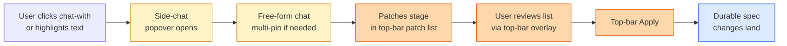
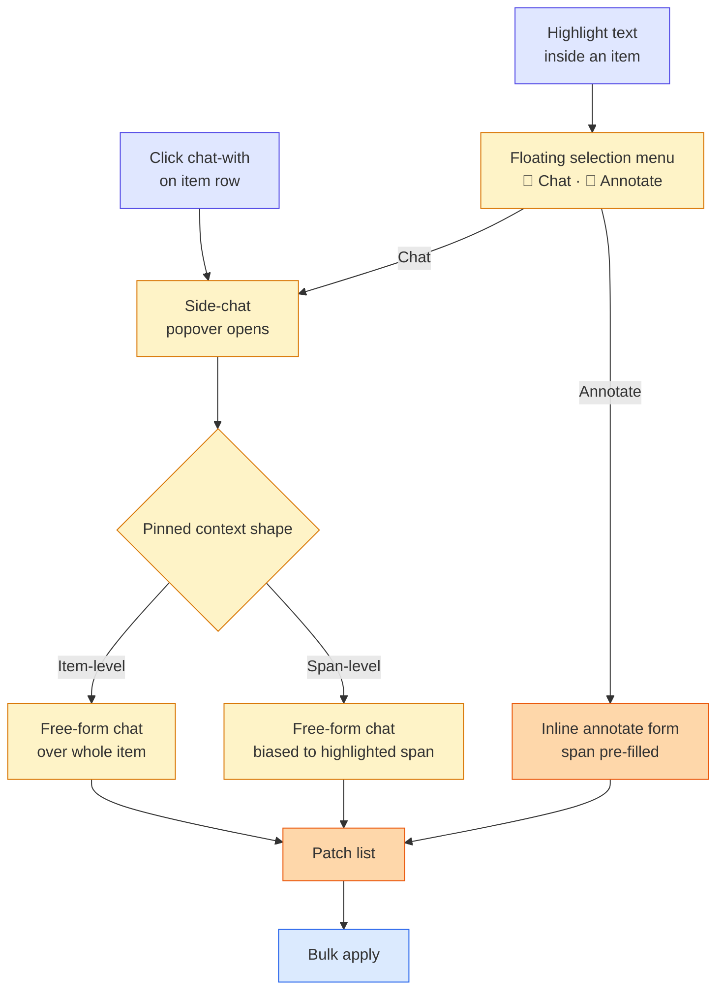
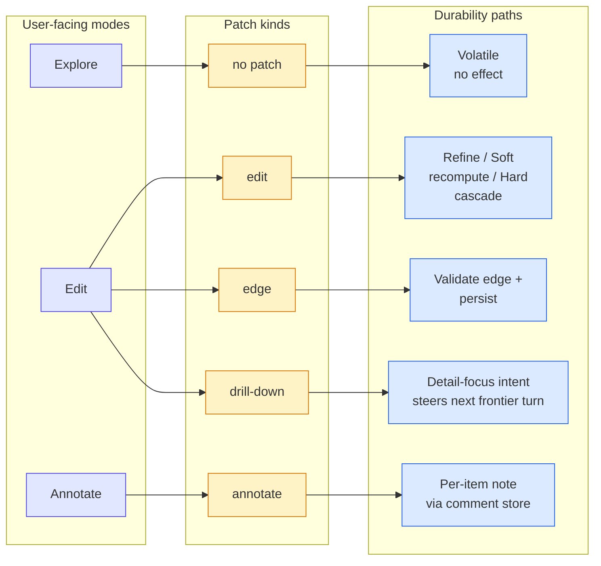
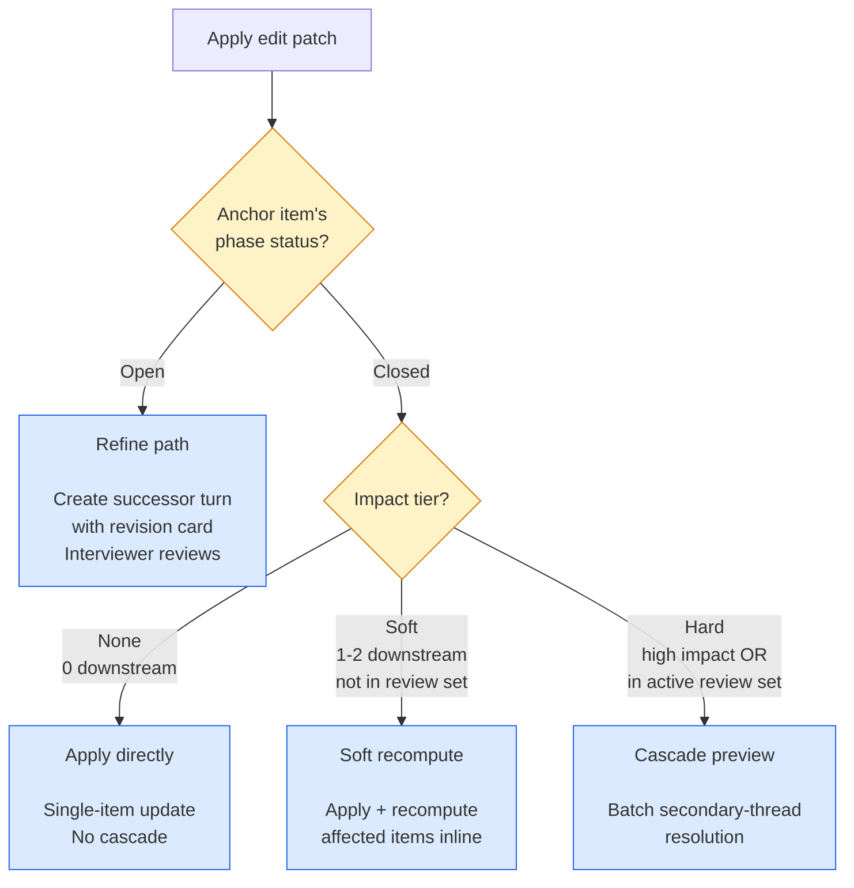

# Side-Chat — Design Spec

> Output of brainstorm session 2026-04-30. Subsumes three previously-separate horizon items in `memory/PLAN.md`: graph-launched refinement (D128), trigger-popover composer, and revisit/edit mode (`docs/design/REVISIT_MODULE.md`).
>
> Status: **proposed** — pending review before transitioning to implementation plan.

## 1. Concept & Problem

Today, all interaction with Brunch's spec runs through one long interview thread: a linear back-and-forth in a single phase chat. When the user opens the structured spec view (graph view) and notices something they want to discuss, edit, annotate, or refine, they have no way to act on that item *in place* — they have to navigate back to the chat and try to reintroduce the topic, often without the system understanding which item they're talking about.

The side-chat adds a second interaction surface: a popover-to-panel chat that opens *from* an item in the structured spec view, with selection-aware context, and that can produce durable changes to the spec through a unified review surface called the **patch list**.

**The side-chat subsumes three horizon items:**

- **D128 graph-launched refinement** — the disabled `chat-with` placeholder on each row in `-structured-list-view.tsx` is the seam this design activates.
- **Trigger-popover composer** (`/` commands, `@` knowledge mentions, `#` phase refs) — folded into the side-chat surface as in-chat affordances.
- **Revisit/edit mode + cascade preview** (`docs/design/REVISIT_MODULE.md`) — the side-chat panel hosts the cascade preview and the secondary-thread walk, replacing the modal in the current REVISIT design.

### At a glance — user flow

Yellow = volatile (no effect yet) · orange = staged (proposed but not committed) · blue = durable (applied to spec). The patch list lives in the persistent top-bar (`N Edits · Undo · Apply`) — visible whether or not the side-chat panel is open.

## 2. Surface & Lifecycle

A hybrid popover-to-panel surface anchored to items in the structured spec view.

- **Two entry modes:**
  - **Button entry** — each row's action rail exposes a `chat-with` button. Clicking opens a popover (~360px wide) anchored to the row, with the *whole item* attached as item-level pinned context.
  - **Selection entry** — the user drags-selects text inside any item's content or rationale. A small floating menu appears anchored to the cursor with two affordances: `💬 Chat` and `📝 Annotate`. Both attach the *highlighted span* as span-level pinned context (excerpt + parent-item reference). `Chat` opens the popover normally; `Annotate` skips the chat and opens the inline annotate form directly with the span pre-filled.
- **Expansion.** The user can expand the popover into a full-height right-side drawer when a thread runs long. Multi-item pinning, the patch list, and the cascade preview all use the expanded panel.
- **Persistence.** The panel persists for the spec session; navigating within the spec preserves the panel and its thread. Closing the panel ends the session.
- **Multi-item pinning is the default model.** A single-item chat is the degenerate case (one pinned context card; same UI). Clicking `chat-with` or selecting text on additional rows pins them as context cards in the panel; the chat reasons across all pinned items.
- **Anchoring.** In V1, the surface is reachable only from the graph view at `/specification/$id/graph`. When the continuous workspace lands, every visible knowledge item across phase sections inherits both entry modes.
- **Single thread per spec session in V1.** The panel hosts one running thread, anchored to the spec. Multiple parallel threads (Figma's `New chat` / `Old chat` tab strip) are deferred to V4 once the patch / event-stream model lets old threads persist durably. V1 may render the tab strip with `New chat` active and `Old chat` shown but disabled — preserves the visual language without the durable-state requirement.
- **Top-bar patch summary.** The persistent app top-bar surfaces the running patch counter — `N Edits` · `Undo` · `Apply` — whenever staged patches exist. This is the canonical patch-list surface (§4); the side-chat panel surfaces patches inline as they're staged but defers to the top-bar for the full list and apply action.

### Entry paths converging on the patch list

Two entry surfaces, three internal paths, one staging area, one apply step. The `Annotate` shortcut from selection-entry skips the chat phase entirely — the user can leave a span-anchored note in two clicks.

## 3. User-Facing Intents & Internal Taxonomy

The side-chat has three orthogonal dimensions:

| Dimension | Values | Visible to user? |
|---|---|---|
| **User-facing mode** | Explore · Edit · Annotate | Yes — three buttons in the chat surface |
| **Patch kind** | `edit` · `edge` · `drill-down` · `annotate` | Yes — each staged patch shows its kind in the patch list |
| **Impact tier** *(for `edit` patches only)* | `none` · `soft` · `hard` | No — system-internal routing |

**Mode → kind mapping:**

- **Explore** never stages a patch. Pure conversation.
- **Edit** stages patches with kind `edit`, `edge`, or `drill-down`, depending on what the chat surfaces. The chat (model-driven) selects the kind based on the conversation: a wording change → `edit`, a graph relationship proposal → `edge`, a "deepen this area" intent → `drill-down`.
- **Annotate** stages a patch with kind `annotate` directly.

**Edit's impact tier is system-decided.** When an `edit` patch applies, the system inspects the anchor item's graph topology and picks the durability path (none / soft / hard — described in §5). The user never has to know the difference between a Refine, a Soft edit, and a Hard edit — those are tier-routing outcomes within the same `edit` patch kind.

This 3-mode collapse was driven by Lu's note: users mentally bucket *exploratory / edit / annotate*, not the 4-class taxonomy that the backend uses.

### Mode → Kind → Path

Three buttons (left), four patch kinds (middle), five distinct durability outcomes (right). The user only sees the modes; the system handles the rest.

## 4. The Patch List (Staging Surface)

The single most consequential design choice in this revision: **promotion is staged, not single-click.**

Instead of *click promote button → one action fires*, the user (and the chat itself) **stages multiple proposed changes** into a list. The user reviews the staged list and applies in batch.

The patch list has **two surfaces** that share one underlying state:

- **Top-bar summary** *(canonical)* — the persistent app top-bar shows `N Edits` · `Undo` · `Apply` whenever ≥1 patches are staged. Clicking `N Edits` opens an overlay listing all staged patches with full per-entry detail. `Apply` performs bulk-apply across all staged patches. `Undo` rewinds the most recent applied batch. Visible regardless of whether the side-chat panel is open.
- **In-panel inline surfacing** *(secondary)* — when patches are staged from inside the side-chat, they animate into a compact list near the bottom of the panel as visual acknowledgment. Per-entry actions (`Edit summary`, `Discard`) are reachable from there without opening the top-bar overlay. This is convenience UI, not source of truth — the canonical state lives in the top-bar.

### 4.1 Patch entry shape

Each patch in the list carries:

| Field | Purpose |
|---|---|
| **Kind** | `edit` / `edge` / `drill-down` / `annotate` |
| **Anchor item(s)** | Reference codes (e.g. `[C1]`, `[G2]→[C2]` for edges) |
| **Selection range** *(optional)* | `{ start, end, snapshotText }` — present only when entered through the selection menu and the patch carries span context. Currently used only by `annotate` patches in V1; `edit`-kind span anchoring is deferred to the patch / event-stream model (A71). |
| **Summary** | One-line human-readable description |
| **Impact tier** | `none` / `soft` / `hard` — drives soft-vs-hard edit routing (§5) |
| **Detail** | Expandable: full payload, affected items, prompt context |
| **Per-entry actions** | `Apply` · `Edit summary` · `Discard` |

**Patch granularity stays item-level in V1.** Even when the chat reasons over a span-level pinned context, the resulting patches anchor to the parent item. Span context is a *prompting hint* (the model is biased to discuss the highlighted span), not a patch granularity. The single exception is `annotate`, which can carry a `selectionRange` so the annotation visibly points to the highlighted phrase (§6.4).

### 4.2 How patches enter the list

- **Chat-proposed.** During a chat exchange, when the conversation surfaces a concrete change, the chat (model-driven) proposes a patch into the list with a brief acknowledgment (e.g. "Staged: edit C1 to widen 'family' to 'household'").
- **User-explicit.** The user can click a "Propose patch" affordance in the chat input area to manually add a patch (kind + anchor + summary) without going through the chat dialogue.
- **Drag from chat.** The user can drag a chat reply that contains a proposal into the patch list to stage it.

### 4.3 Bulk apply

The top-bar `Apply` button performs **bulk-apply** across all staged patches in dependency order. Patches with conflicting anchors (two edits on the same item) prompt for resolution before apply. The button is the single canonical commit affordance — there is no per-entry apply in V1; users either apply everything staged or discard what they don't want first.

### 4.4 Why this matters

The patch list is **the unifying review surface for all spec mutations**. The same surface the architect loop (§7) will later use to deposit system-generated proposals for HITL review. Designing the side-chat around the patch list now means the architect loop has somewhere to deposit when it ships, with no second review UI to invent.

## 5. Edit Patch Routing

When a patch with kind `edit` is applied, the system routes by **two questions in order**:

1. **Is the anchor item's phase OPEN or CLOSED?**
   - **Open** (anchor item is in the current frontier-bearing phase) → **Refine path** (§6.2): create a same-phase successor turn with a revision card. The interviewer reviews and accepts as part of normal turn flow. If downstream items exist, the cascade preview from §5.3 still applies before the successor turn lands.
   - **Closed** (anchor item is in a phase whose lifecycle is closed) → continue to (2).
2. **What is the impact tier of the retroactive edit?** *(§5.1)*

### 5.1 Impact tiers (retroactive edits, anchor item in closed phase)

| Tier | Trigger | Path |
|---|---|---|
| **None** | `affectedCount === 0` (item is a graph leaf with no downstream edges) | Apply directly. Single-item content update; brief inline confirmation card in the panel: "Updated `[X]`." |
| **Soft** | `1 ≤ affectedCount ≤ 2` AND no anchor or affected item is in an active review set *(active = generated and not yet accepted)* | Apply with **soft recomputing**. Patch lands directly; brief inline confirmation lists the affected items: "Updated `[X]`; recomputed `[Y]`, `[Z]`." No cascade preview. |
| **Hard** | High downstream count, OR any anchor or affected item is in an active review set | **Cascade preview** → batch-resolution secondary-thread mode (§5.3). Current REVISIT_MODULE flow. |

### 5.2 Confidence model — V1

V1 ships with **mechanical-only** routing: `affectedCount` and review-set membership are deterministic and trivially computable from the existing graph state. No semantic-shift detection in V1. Tuning the count thresholds (currently `0` for None, `1–2` for Soft, `3+` for Hard) is deferred until we have user-flow data on whether soft-edit feels too aggressive or too cautious.

### 5.3 Hard edit — batch resolution

Lu's batch idea reshapes the current REVISIT secondary-thread walk. Instead of "walk each affected item one at a time," the cascade preview groups affected items by predicted resolution shape:

- **Auto-confirm group** — review-only affected items (no content change needed). One click confirms all.
- **Auto-edit group** — items where the change is a mechanical text replacement (e.g. "family" → "household" in derived items). One click applies all.
- **Substantive group** — items where the user's judgment is required. Walk these one at a time using the existing REVISIT resolution flow.

A typical 5-item cascade collapses from ~5 sequential resolutions to 2 group decisions + 1 substantive walk.

## 6. Class-Specific Durability Mechanics

For reference. Each is invoked by the patch-list bulk-apply.

### 6.1 Class 1 — Explore

Volatile chat thread. Nothing leaves the panel. Discarding the panel ends the thread.

### 6.2 Class 2 — promote-to-turn intents

| Intent | Mechanism |
|---|---|
| **Refine** | Patch with kind `edit` whose anchor item is in the **open** phase (per §5 routing). Creates a same-phase successor turn with a revision card stacked on a question card. Reuses Requirement 25's revision pattern. If the anchor has downstream items, the cascade preview from §5.3 runs before the successor turn lands. |
| **Drill-down** | Patch with kind `drill-down`. Emits a `detail-focus` intent attached to the anchor's reference code. Steers the next frontier turn in the relevant open phase. Reuses D127's progressive-detail seam. |
| **Propose-edge** | Patch with kind `edge`, anchor is a pair of items. Validated through D125's typed relation-policy registry. If valid, persists; if not, returns policy feedback in the patch detail. |

### 6.3 Class 3 — promote-to-edit intents

Routed via §5. Soft and Hard edits both produce durable item content changes; the difference is whether the user sees cascade preview before commit.

### 6.4 Class 4 — Annotate

Patch with kind `annotate`. Persisted as an `item_annotation` row keyed by `(specificationId, itemKind, itemId, authorTurnIdOrNull)`. **Annotations and review-set per-item comments share one comment store** — they're the same row type, distinguished only by an `origin` field (`annotation | review-comment`). One annotation IS one comment.

**Span-anchored annotations.** When entered through the selection menu, the patch carries `selectionRange: { start, end, snapshotText }`. The annotation row stores the range alongside the note. `snapshotText` is the highlighted phrase at the time of save — used for fuzzy reattach if the rationale or content is later edited.

Surfacing rules:

- **Graph view row** — badge in the action rail (count + hover preview). Span-anchored annotations show the excerpt above the note in the hover.
- **Inline content tint** — when the row is expanded and the parent text is rendered, span-anchored annotations apply a subtle background tint to the highlighted phrase. Clicking the tint opens that annotation directly.
- **Review-set card** — when a review set is regenerated and includes the anchor item, the existing annotation surfaces as the per-item comment for that row, pre-filled but editable. The user can keep, edit, or clear it for fresh review feedback.
- **Relation-chip hover** — `RelationChipPreview` extends to show "📝 N" if the linked item has annotations; clicking the preview opens the side-chat with the annotation pinned.

**Drift handling without versioning.** If the parent item's content is later edited and `snapshotText` no longer matches its original position, fuzzy reattach attempts to find the new location. On low-confidence match or no match, the annotation degrades to **item-level** with a "🔗 originally referenced text that has since changed" indicator surfaced inline; the user can re-confirm by clicking through to the annotation, optionally re-anchoring to a new selection. The original `snapshotText` is preserved as audit. Once item versioning lands (A72), span anchors can attach to a specific version and never silently drift.

## 7. Out of Scope (Acknowledged Adjacents)

- **Architect / generator loop.** An autonomous agent that iterates over the graph and proposes changes for HITL review. Symmetric to the side-chat in *what it does* but different in *who drives*. Future Horizon item in `memory/PLAN.md`. Will deposit into the same patch list once the patch / event-stream data model lands.
- **Explicit chat-level branching UI.** The `spec → chat → turns` future data model implicitly allows multiple chats per spec, but no "branch this thread" affordance ships. D80's no-turn-branching invariant stays in force.
- **Cross-spec annotation sharing.** Out of scope per the existing constraint of no collaborative editing.
- **Slash commands / `@` mentions / `#` phase refs.** The trigger-popover composer's command syntax is folded conceptually but not implemented in V1; the panel uses click-to-pin and free-form chat as the input model. Slash commands ship as a later enhancement.

## 8. Dependency Assumptions

Two upstream changes are noted as **future-work assumptions** in `memory/SPEC.md`. Neither blocks V1.

### A71: patch / event-stream data model

`spec → chat → turns` with diff patches as the persistence primitive. The side-chat's patch list maps onto this model naturally. On the current store-of-stores, the V1 patch list is internally a lightweight in-memory staging area that translates to the existing per-store mutation calls at apply time.

**Implication if this lands later:** the patch list's apply step becomes a single `appendPatch(spec, patch[])` call instead of a fan-out across stores. No user-facing change.

### A72: knowledge-item versioning

History per knowledge item, preserved through edits. Anchors annotations to specific versions, preserves audit trail on soft edits, lets revisit cascades produce new versions instead of invalidating.

**Implication if this lands later:** annotations can survive item edits without dangling; soft edits become trivially reversible. V1 ships without versioning; annotations float over current item content and may dangle on edit (rare in V1, accepted risk).

### A73: architect / generator loop

Captured in §7. The side-chat is *user-driven*; the architect is *system-driven*. Both deposit into the patch list. Designing the side-chat's patch-list surface now means the architect has a review surface ready when it ships.

## 9. Phasing

| Version | Ships |
|---|---|
| **V1** | Popover-to-panel surface · multi-pin · Class 1 (Explore) · Class 4 (Annotate). Patch list surface (top-bar summary + overlay) introduced but holds at most one entry (annotation only). Single thread per spec session; tab strip rendered with `Old chat` disabled placeholder. No Edit, no Drill-down, no Propose-edge. |
| **V2** | Edit (router) · Drill-down · Propose-edge in the patch list. **None** and **Soft** edit tiers apply directly. **Hard** edit defers to a placeholder "feature coming" message. Refine routes through normal turn machinery. |
| **V3** | Hard edit absorbs REVISIT_MODULE — cascade preview inline, batch-resolution secondary-thread mode in the panel. REVISIT modal goes away. |
| **V4 (later)** | Patch / event-stream data model + item versioning land. Architect loop can deposit into the same patch list. Multiple persistent chat threads per spec (`Old chat` tab activates). |

## 10. Verification Stance

| Loop | Coverage |
|---|---|
| **F1 component tests** | Popover, panel, patch-list rendering, per-entry kind variants, cascade preview, secondary-thread item-walker. |
| **F2 router-integrated tests** | `chat-with` → popover → multi-pin → patch list → apply → main-flow effect. Specifically: drill-down apply → next-turn intent chip → question-card materialization steered by the intent. |
| **F3 a11y** | Popover and panel keyboard navigation, focus return on dismiss, ARIA labels for patch-list entries. |
| **F5 network-call counter** | Soft-edit auto-apply does **not** trigger cascade-preview endpoints. Hard-edit triggers exactly one cascade preview. Apply triggers exactly one bulk-apply call regardless of patch count. |
| **F6 fixture matrix** | Impact-tier routing fixtures: leaf-edit (`none`), 2-downstream-edit (`soft`), in-review-set-edit (`hard`), edge-proposal-with-policy-violation (rejection path). |
| **F7 dramaturgical walkthrough** | The three flows already documented (Edit-with-cascade, Drill-down, Annotate) plus one new flow: multi-patch staging → bulk apply across mixed kinds. |

## 11. UI Language

This section codifies the design tokens and visual conventions adopted from the HASH product surface (`figma.com/design/nTw9n0blCJm1j9t22Jo72d` — node `969:386`). Brunch's existing CSS-variable token system already covers most of the Figma palette; entries below note where the Figma maps onto existing brunch tokens versus where a new pattern is introduced. Elements present in the Figma reference but not relevant to the side-chat (Safari chrome, brunch's existing phase navigation sidebar treatment, page-title gradient text, skeleton placeholders) are intentionally not adopted here.

### 11.1 Typography

- **Family:** Inter (400 regular, 500 medium). Already in use across brunch.
- **Sizes:**
  - 14px — primary UI / body / button labels
  - 13px — secondary panel rows
  - 12px — tertiary / sub-items
  - 11px — small label tags (e.g. impact tag)
- **Line-height:** 1.6 for body, `leading-none` for compact buttons / chips, 16px for compact UI labels.

### 11.2 Color tokens

| Figma hex | Role | Brunch token |
|---|---|---|
| `#202020` | Primary ink | `text-ink` |
| `#5b5b5b` | Secondary text | `text-sub` |
| `#a6a6a6` | Hint / muted text | `text-hint` |
| `#ffffff` | Card surface | `bg-background` |
| `#fafafa` | Soft surface, panel wash | `bg-tint` |
| `#f2f2f2` | Chip fill, secondary button | `bg-wash` |
| `#e3e3e3` | Borders, rules | `border-rule` |
| `#2070e6` | Primary blue (active states, links) | existing brunch primary |
| `#3484fa → #2070e6` | Primary CTA gradient | new — only for primary buttons |
| `#e14640` | High-impact red label | new — `text-impact-high` |
| HASH brand gradient | Side-chat panel halo | new — see §11.5 |

### 11.3 Spacing & rounded scale

- **Rounded scale:** 4 / 6 / 8 / 12 / 16. Buttons 6, chips 4, cards 8 / 12, panels 16.
- **Padding:** chip 6–8px, button 8–12px, card 12px, panel outer 8px / inner 12px.
- **Component sizes:** icon button 24×24 or 28×28; chip height 24–28; standard button 32; card row 32.

### 11.4 Components

| Component | Treatment |
|---|---|
| **Primary button (Apply, Send)** | Gradient `#3484fa → #2070e6`, ring shadow `0 0 0 1px #1060d6`, multi-stop drop shadow stack, inner `0 1 1 rgba(255,255,255,0.2)` highlight, white text, 6px rounded. |
| **Secondary button (Undo, Skip, Back)** | `bg-wash` fill, no border, muted text (`#a6a6a6`), 6px rounded. |
| **Soft chip** | `bg-[rgba(0,0,0,0.03)]`, 4px rounded, 6px padding, 14px regular text, optional `×` dismiss on the right. Used for pinned context cards. |
| **Card (white surface)** | `bg-background`, `border border-rule`, 12px rounded, 16px padding. Optional 4-stop drop shadow for elevated state. |
| **Activity card** | Animated gradient text on the header row + indented step list with a 1px vertical rule on the left edge. Used for the drill-down "pending intent" indicator and the live generation indicator. |
| **Tab strip** | Two-tab row with active tab as a white card (shadow ring) and inactive tab as a transparent fill (`bg-[rgba(0,0,0,0.04)]`). |

### 11.5 Side-chat brand surface

The side-chat panel uses a **frosted-glass + brand-halo** treatment that visually separates it from the main interview surface:

- **Backdrop:** `backdrop-blur-12px` with `bg-white/70`.
- **Border:** 1.5px solid `#5424ff` at 55% opacity.
- **Halo:** outer blurred gradient ring using the HASH brand colors (purple `#5424ff` → orange `#fdb975` → pink `#fe5dd3` → magenta `#ff00ae`), 25% opacity, 20px blur.
- **Rounded:** 16px outer, 12px inner cards.
- **Anchor:** top-right of the spec view, ~588px wide when expanded to panel; ~360px when in popover state.

This brand-halo is used **only on the side-chat panel** in V1. The main interview surface, the graph view, and the phase navigation sidebar retain their flat / surface-only treatment. The brand halo signals "this is a generative AI surface" — distinct from the durable-spec surfaces around it.

### 11.6 Top-bar patch summary

The top-bar patch summary (§4) sits in the persistent app top-bar above the workspace stream and graph view. When zero patches are staged, it shows nothing extra. When ≥1 patches are staged:

- **Counter:** `N Edits` in `text-sub` Inter medium 14px, with chevron-down toggle for the overlay.
- **Secondary `Undo` button:** chip-style on `bg-wash`.
- **Primary `Apply` button:** gradient CTA per §11.4.

Clicking the counter opens an overlay panel listing staged patches. The overlay can be opened independent of the side-chat panel — the architect loop in V4 will deposit patches that the user can review and apply without ever opening the side-chat.

## 12. Open Questions for Implementation

- **Confidence model heuristics.** What `affectedCount` threshold is right for soft vs hard? Probably needs A/B observation post-V2 once we have flow data.
- **Patch conflict resolution.** When two staged patches modify the same anchor, what's the resolution UX? Likely: surface conflict at apply time, ask user to pick or merge. Defer detailed design to V2.
- **Chat-runtime sharing.** Does the side-chat use the main interview's runtime (cheaper context, shared cost) or a separate scoped runtime (clean isolation)? V1 uses a separate runtime to avoid coupling; revisit if token cost becomes an issue.
- **Patch list persistence across page reload.** Does the patch list survive a browser reload, or is it session-scoped only? V1: session-scoped, in-memory. Persist when the patch / event-stream data model lands (A71).

---

## Traceability

- **Replaces** PLAN.md horizon items: graph-launched refinement (under D128), trigger-popover composer, revisit / edit mode + cascade preview (`docs/design/REVISIT_MODULE.md` becomes a sub-document of this design).
- **Reuses** D125 (typed relation policy), D127 (progressive-detail seam), D128 (graph view actionable workspace mode), Requirement 25 (revision card pattern).
- **Adds** future assumptions A71 (patch/event-stream model), A72 (item versioning), A73 (architect loop).
- **Bounded by** D80 (no turn-tree branching), D89 (card-owned input), D113 (no second durable workflow model), D66 (user authorizes).
