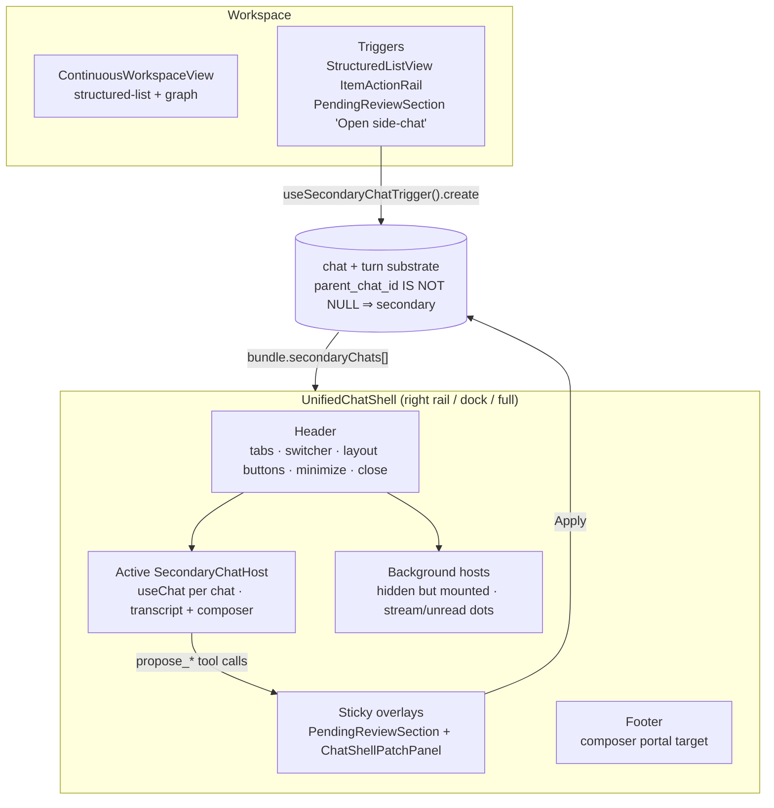
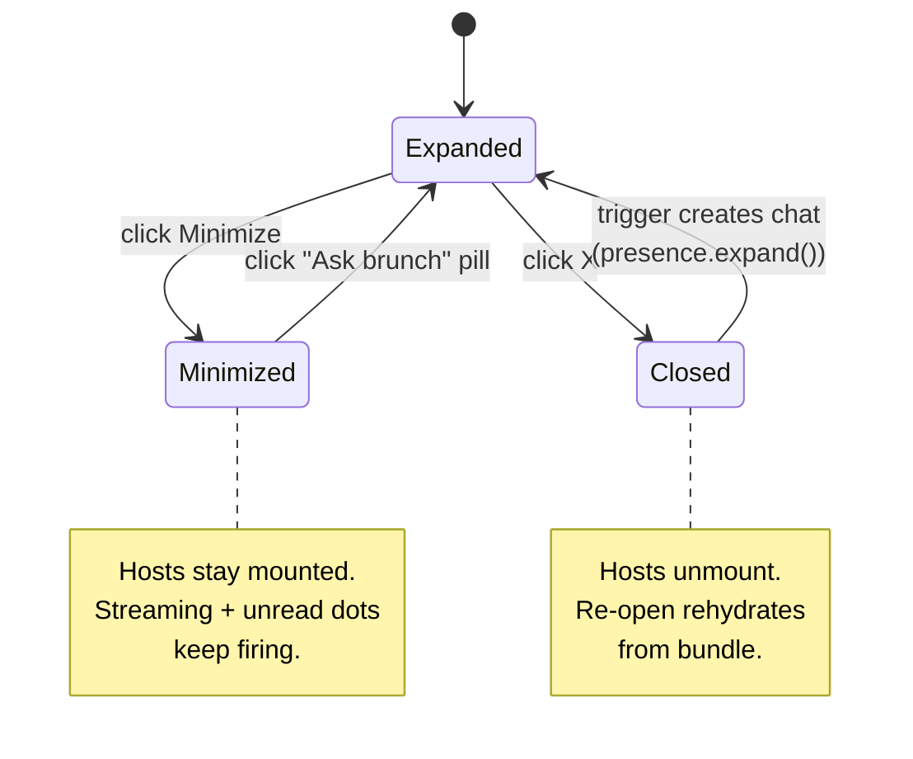
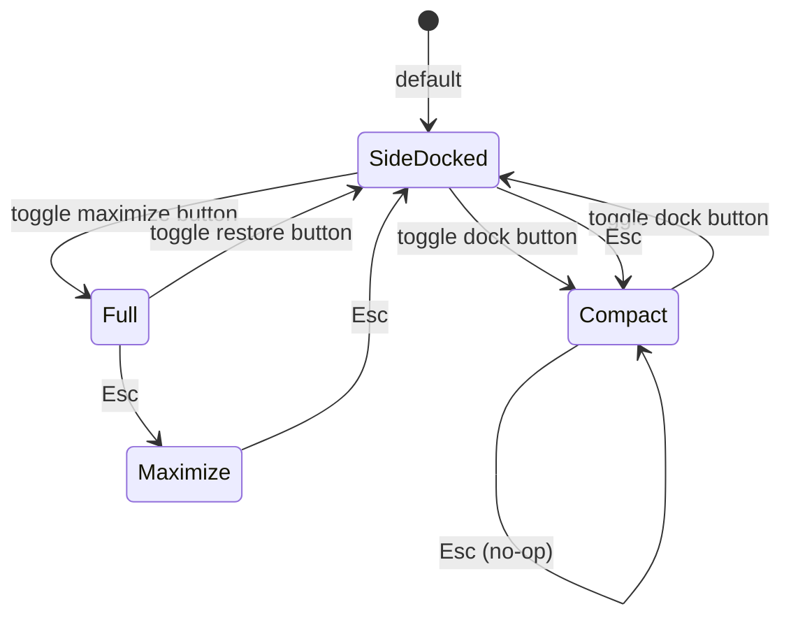
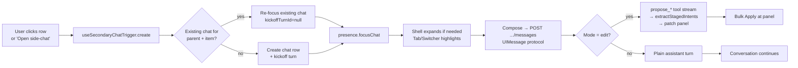

# FE-716 — Chat Runtime Walkthrough (call notes)

> Reference brief for talking through PR #141 (`ka/fe-716-chat-runtime-unified-secondary-chats`, merged).
> Pairs with `docs/design/CONVERSATIONAL_WORKSPACE_RUNTIME.md` (umbrella) and `docs/design/UNIFIED_CHAT_UX.md` (visual brief).
> Old testing guide referenced is the **V3.1 side-chat popover** flow — most of its surface is gone; capabilities are re-surfaced on a different shape.

---

## Executive summary

PR #141 lands **V1 of Track 2 (`chat-runtime-secondary-chats`)** from the Conversational Workspace Runtime. It replaces the V3.1 `SideChatPopover` + `SideChatHost` popover machinery with a **unified expandable chat shell** that hosts a primary "master" chat plus N **secondary chats** anchored to items or reconciliation needs — all on the existing `chat` + `turn` substrate (no new `thread` table per Decision D153).

What changed for the user:

- A persistent **chat shell** docks to the right of the workspace (default `side-docked` ~50%; toggles to `compact`, `maximize`, `full`).
- Clicking **chat-with on a row** no longer opens a popover — it opens (or focuses) a **secondary chat tab** inside the shell, with the item pinned.
- Each chat is durable, switchable (tab strip + dropdown when 2+ item chats exist), and runs its own streaming `useChat<BrunchUIMessage>` instance in parallel.
- **Ask** and **Edit** modes are a per-chat toggle (Ask = `explore`, Edit = `edit`). Edit gates `propose_edit / propose_edge / propose_drill_down` tools.
- **Staged patches** from any chat collect in a single shell-level panel (`<ChatShellPatchPanel>`) — bulk Apply at the header, per-row Discard. The old top-bar `<PatchListOverlay>` is mount-commented out.
- **Pending review** (reconciliation needs) is hoisted into the shell body above the patch panel. The substantive-row trigger now opens a secondary chat instead of focusing the popover.
- Layout state, presence (`expanded` / `minimized` / `closed`), and the open chat survive across navigation; layout mode persists per-spec in localStorage.

What did **not** ship in V1 (with the design doc's track ownership):

| Missing capability                                  | Owning track / frontier                | Reason it's not here                                                                                |
| --------------------------------------------------- | -------------------------------------- | --------------------------------------------------------------------------------------------------- |
| `$` thread mentions, `!` annotation mentions, `@`   | Track 5 — `chat-context-provision`     | Mention substrate beyond `#REF-CODE` is part of context provision, not chat runtime.                |
| Snapshot builder family + handle refresh            | Track 5 — `chat-context-provision`     | Needs Track 4 changeset-backed item versions before stale-handle freshness is meaningful.           |
| Target-grouped reconciliation UX + "Reconcile Now"  | Track 3 — `reconciliation-runtime`     | V1 only resurfaces the **existing** PendingReviewSection inside the shell; full Track 3 UX is later.|
| Full `PendingReviewSection` retirement              | Track 3 — `reconciliation-runtime`     | Same as above — retirement happens once Track 3 ships parity.                                       |
| Changeset / change tables (semantic mutation spine) | Track 4 — `changeset-ledger`           | Runs in parallel; not blocking Track 2 surface work.                                                |
| Agent-run inline rendering (C7)                     | Within FE-716 scope but **blocked**    | No producer surface emits agent-run secondary chats yet; substrate is ready.                        |
| Strategy sub-chat UI                                | Follow-up frontier                     | Strategy is chat-local state; surface design waits for use cases.                                   |
| Shift+Tab mode toggle, Ladle prototype              | Skipped / parked                       | Mode toggle is in the composer chip; visual iteration adopts `ai-elements` directly, not isolated stories. |
| Persisting assistant turns as structured `parts[]`  | Follow-up                              | Wire-protocol carries `BrunchAssistantPart[]`, persistence stays text-only until a consumer needs it.|

`npm run verify` is green at merge: 108 test files / 1273 tests.

---

## What changed vs. the old testing guide

The old testing guide (V3.1) walked through a **popover surface** with a top-bar staged patch list and a standalone Pending review section. After FE-716:

| Old guide concept              | FE-716 mapping                                                                                                          |
| ------------------------------ | ----------------------------------------------------------------------------------------------------------------------- |
| Side-chat popover + drag-out   | **Retired.** Replaced by `<UnifiedChatShell>` docked to the right.                                                      |
| Span-level "💬 Chat / 📝 Annotate" floating menu | The Chat path opens a secondary chat (no popover). **Annotate flow not re-surfaced in V1** (no annotation composer in the shell yet — needs a follow-up scope card). |
| Top-bar `N change(s) · Undo · Apply` | **`<ChatShellPatchPanel>`** mounted inside the shell body. Header shows count + Apply; rows show kind, summary, impact chip, optional ContentDiff, Discard. |
| Pending review section (separate) | Same `<PendingReviewSection>` component, now mounted **inside the shell body** above the patch panel.                |
| Run agent / classifier chips   | **Unchanged** — `<ClassificationChip>` + pending-review rows reuse the existing classifier flow. Track 3 retirement is later. |
| Substantive row → "Open side-chat" | Now opens a **secondary chat** (with `pinned_reconciliation_need_id` set so the C9 panel renders).                  |
| Direct row edit                | Unchanged. Still stages into the same shared patch list — now visible in the shell panel.                              |
| Soft/Hard impact tier routing  | Unchanged. Soft applies in-place + toast; Hard opens Pending review rows.                                              |
| Propose-edge / Drill-down      | Unchanged tool surface; tools gated on Edit mode of a secondary chat.                                                  |

---

## Architecture at a glance

Substrate (no new tables, four migrations):

- `drizzle/0020` — `chat.parent_chat_id`, `invoked_in_turn_id`, `pinned_item_id`, `pinned_span_hint`
- `drizzle/0021` — `chat.mode` (`'explore' | 'edit' | null`)
- `drizzle/0022` — `chat.pinned_reconciliation_need_id`
- `drizzle/0023` — `chat.anchored_item_ids` (Track 5 will revisit this column — see C deferral)

Secondary-chat projection is purely `parent_chat_id IS NOT NULL`. There is **no `chat.kind = 'secondary'` enum**; kind enum stays `interview | side_chat`.

---

## UI elements — what each one does

### Shell chrome

| Element (testid)                                  | Role                                                                                                                                                          |
| ------------------------------------------------- | ------------------------------------------------------------------------------------------------------------------------------------------------------------- |
| `unified-chat-shell`                              | The expanded shell wrapper. `data-layout-mode` ∈ {compact, side-docked, maximize, full}.                                                                       |
| `unified-chat-shell-minimized` (the "Ask brunch" pill) | Bottom-right pill when shell is minimized. Shows open-chat count. Click → expand.                                                                          |
| `unified-chat-shell-header`                       | Header strip with tabs/switcher on the left, control buttons on the right.                                                                                    |
| `unified-chat-shell-minimize`                     | Minimize → pill. Hosts stay mounted; streaming/unread dots keep firing.                                                                                       |
| `unified-chat-shell-layout-side-docked`           | Toggles between `compact` and `side-docked`. Active state tinted.                                                                                             |
| `unified-chat-shell-layout-toggle`                | Toggles between `side-docked` and `full`. (Maximize tier exists internally; Esc walks down through it.)                                                       |
| `unified-chat-shell-close`                        | Close — collapses the shell entirely (presence `closed`). Re-opening reconstructs from bundle.                                                                |
| `unified-chat-shell-tabs` / `ChatTabs`            | Tab strip — one tab per "promoted" chat. Tabs carry streaming dot (emerald, animated) and/or unread dot (sky-blue). Active-tab click is a no-op or re-focus.   |
| `chat-switcher-trigger`                           | Dropdown when 2+ item-anchored chats exist; aggregates streaming/unread state across hidden chats; trigger styled with the active chat's `kindAccentHex`.     |
| `unified-chat-shell-body`                         | Scrollable body. Scrollbar takes the active chat's kind accent at 20% opacity.                                                                                |
| `chat-shell-sticky-overlays`                      | Sticky band at top of body when patches or reconciliation needs exist; collapses entirely when both feeds are empty.                                          |
| `unified-chat-shell-scroll-to-bottom`             | Arrow button that surfaces when scroll position is > 50% from bottom.                                                                                          |
| `unified-chat-shell-footer`                       | Empty container that the active chat's composer portals into.                                                                                                  |

### Inside the active chat (`<SecondaryChatHost>` + `<SecondaryChatCollapsible>`)

| Element (testid)                                  | Role                                                                                                                                                          |
| ------------------------------------------------- | ------------------------------------------------------------------------------------------------------------------------------------------------------------- |
| `secondary-chat-collapsible`                      | Transcript surface. Carries `data-secondary-chat-id` + `data-accent-hex` (anchor kind's accent).                                                              |
| `secondary-chat-reconciliation-panel`             | Renders only when `pinnedReconciliationNeed` is set. Shows need kind label (Supersedes / Needs confirmation) + source ref-code + target ref-code + excerpts.   |
| Kickoff turn (`kickoffContent`)                   | First assistant message — `Anchored to '<item>'.` (with `, focused on ''` when a span hint was passed).                                                  |
| `SecondaryChatFreshStateHero` (turn-zero)         | Shown when no turns exist. Three static "How to start" chips (`Summarize this spec`, `What needs attention?`, `Suggest next steps`) + `<SecondaryChatSuggestions>`. |
| `secondary-chat-bottom-anchor`                    | Sentinel for autoscroll; scrolls into view on new turn or streaming-text growth.                                                                              |
| `secondary-chat-jump-to-anchor`                   | "Jump" button (Crosshair icon) in collapsible header when `invoked_in_turn_id` is set. Smooth-scrolls workspace center to the originating turn + briefly highlights it. |
| `secondary-chat-kind-chip`                        | Mode chip in header — `PencilLine` "Edit" or `MessageCircleQuestion` "Ask".                                                                                    |
| `<SecondaryChatComposerPanel>` (portaled to footer) | Textarea + Send. Placeholder copy depends on mode + pinned-state + turn-zero (e.g. "Propose a change to your spec…").                                       |
| Mode toggle (in composer)                         | Segmented Ask/Edit. PATCH `…/mode`. Locked while a request is in flight.                                                                                       |
| `<SecondaryChatMentionPopup>`                     | `#`-triggered autocomplete on the composer. Resolves to knowledge-item ref codes (e.g. `#G1`, `#D5`). Adds a context snapshot to the next user message.        |
| `<ProposeChangeChips>`                            | Edit-mode-only suggestion chips above composer (suppressed on turn-zero).                                                                                      |

### Shell-mounted overlays

| Element                                  | Role                                                                                                                                                              |
| ---------------------------------------- | ----------------------------------------------------------------------------------------------------------------------------------------------------------------- |
| `<PendingReviewSection>` (in shell body) | **Unchanged** component, relocated. Lists open reconciliation needs. Substantive row's "Open side-chat" now triggers `useSecondaryChatTrigger().create({ kind, id, reconciliationNeedId })`. |
| `<ChatShellPatchPanel>` (`chat-shell-patch-panel`) | Single union view of staged patches across **all** chats (uses `usePatchList()`, not the per-chat partition). Header: `N change(s)` + Apply. Per row: kind icon (Pencil/Spline/ArrowDownToDot/NotebookPen), ImpactChip (edits), summary, ref-code, Run-agent button (placeholder, no backend yet), Discard (X). Edits render an inline `<ContentDiff>` when before/after differ. |
| `<ChatShellAppliedToast>`                | Floats above the pill (when minimized) or in body (when expanded). Survives shell remounts via `useStablePatchListEnv`. 5s Undo window.                          |

### Workspace-side triggers

| Trigger                                                  | Surface                                                                                                          |
| -------------------------------------------------------- | ---------------------------------------------------------------------------------------------------------------- |
| `ItemActionRail` in `StructuredListView`                 | Adds an "Open inline chat" button (`data-graph-action="open-inline-chat"`, `MessagesSquare` icon) on each row.   |
| `PendingReviewSection` substantive row "Open side-chat"  | Calls trigger with `reconciliationNeedId` so the C9 panel renders.                                               |
| `WorkspaceArtifactRow` (`data-anchor-turn-id`)           | Scroll target for `secondary-chat-jump-to-anchor`. Threaded through every relevant turn-render artifact.         |

---

## Modes & state machines

### Presence (shell appearance)

### Layout mode (per-spec localStorage)

Layout-mode key: `brunch:chat-layout-mode:{specificationId}`. Maximize is not directly bindable via a button — it lives between `side-docked` and `full` in the Esc-decrement chain.

### Per-chat composer mode

| Mode (user-facing) | `chat.mode` | Tool gating                                                                          |
| ------------------ | ----------- | ------------------------------------------------------------------------------------ |
| **Ask**            | `explore`   | Read-only assistant. No `propose_*` tools registered.                                |
| **Edit**           | `edit`      | `propose_edit`, `propose_edge`, `propose_drill_down`. Edits stage into patch panel.   |

The mode is **persisted on the chat row forever** at first send (per `UNIFIED_CHAT_UX.md` §2). Toggling later updates the column; tool gating follows the latest mode but original kind chip stays.

### Secondary chat lifecycle

Dedupe key for item chats: `(parent_chat_id, pinned_item_id, pinned_reconciliation_need_id IS NULL)`. Reconciliation chats always create fresh (`reconciliationNeedId` non-null).

---

## End-to-end flow comparison (vs. old testing guide checklist)

| Old guide step                            | FE-716 state                                                                                                            |
| ----------------------------------------- | ----------------------------------------------------------------------------------------------------------------------- |
| 1. Surface & pinned context (chat-with, multi-pin, drag-to-side) | Replaced by row-action → secondary chat tab. **Multi-pin not yet** — anchor columns support `anchored_item_ids` but UI only surfaces the primary `pinned_item_id`. |
| 2. Explore                                | ✅ Ask mode on an empty/master chat. Streaming reply; nothing stages.                                                    |
| 3. Annotate                               | ⚠️ **Not in V1.** The annotate composer was popover-bound; no shell equivalent yet. (Annotation API still exists; trigger UX needs a follow-up.) |
| 4. Direct row edit                        | ✅ Unchanged. Lands in the shell patch panel along with chat-driven patches.                                              |
| 5. Soft-tier edit                         | ✅ Unchanged. Applies in-place with toast.                                                                                |
| 6. Hard-tier edit → Pending review        | ✅ Pending review now renders in the shell body above the patch panel.                                                    |
| 7. Run agent classifier chips             | ✅ Unchanged classifier pipeline (`ClassificationChip`). Bulk Confirm-all / Apply-all-suggested unchanged. Full Track 3 UX deferred. |
| 8. Re-entrant cascade ("Edit target")     | ✅ Still works through the same Pending review row affordances.                                                            |
| 9. Propose-edge                           | ✅ `propose_edge` tool available in Edit mode; multi-pin caveat applies (one anchor in UI).                               |
| 10. Drill-down                            | ✅ `propose_drill_down` tool available in Edit mode.                                                                       |

---

## What's missing & why — mapped to Conversational Workspace Runtime tracks

`docs/design/CONVERSATIONAL_WORKSPACE_RUNTIME.md` §5 defines five tracks. FE-716 lands V1 of Track 2 only. Each missing capability below cites the tracking doc.

### Track 2 (`chat-runtime-secondary-chats`) — what's still pending **inside this frontier**

- **C7 Agent-run inline rendering.** Substrate ready (`first_turn_role='system'` projects `agent_run` flavor), but no producer emits an agent-run secondary chat yet. Blocked on a consumer.
- **Annotate composer in the shell.** V3.1 annotate flow was popover-only. Re-surfacing it on the shell needs a small follow-up card (selection menu → secondary chat with annotation composer).
- **Multi-pin UI.** `anchored_item_ids` column exists; the shell only renders the single `pinned_item_id`. Adding chips for additional anchors is a UI follow-up.
- **Per-tab close + tab reordering.** Parked (CARDS §parking lot).
- **`!` and `$` mention chips on the composer.** `#` lands in V1; `$` and `!` are Track 5.
- **Slice 4b transcript popover / Slice 5–6 footer chat.** Briefly built then **reverted on 2026-05-19** because the expandable shell direction was reinstated. Orphan modules (`chat-transcript-popover.tsx`, unused props on `chat-tabs.tsx` + `secondary-chat-host.tsx`) are still in tree pending a deletion sign-off.

### Track 3 (`reconciliation-runtime`) — entirely deferred

Per `CONVERSATIONAL_WORKSPACE_RUNTIME.md` §3.3. V1 keeps the existing `<PendingReviewSection>` as a flat list inside the shell body. **Not yet**:

- Target-grouped reconciliation **chat** (one secondary chat per target group).
- Async-by-default classifier scheduling (today's classifier runs on user click).
- **"Reconcile Now"** explicit trigger affordance.
- `<PendingReviewSection>` retirement after target-grouped UX reaches parity.
- Workspace-level subtle badges on items with open non-auto-confirmed needs.

The C9 panel ("elements being reconciled") inside a secondary chat is a **lightweight bridge** only — it labels the source/target endpoints when a substantive row opens a chat. It is explicitly **not** the Track 3 UX.

### Track 4 (`changeset-ledger`) — entirely deferred

Per `CONVERSATIONAL_WORKSPACE_RUNTIME.md` §3.4. Patches today are still transitional client state; accepted edits flow through existing Brunch-owned handlers. **Not yet**:

- `changeset` / `change` tables and durable mutation history.
- `reconciliation_need.caused_by_changeset_id` wiring.
- Provenance bundling (originating turn/chat, base semantic state).
- Renaming client `patch` vocabulary to `change`.

### Track 5 (`chat-context-provision`) — V1-narrow only

Per `CONVERSATIONAL_WORKSPACE_RUNTIME.md` §3.5. V1 ships only the `#REF-CODE` resolver (server-owned, scoped to the spec). **Not yet**:

- `$` thread mention symbol.
- `!` annotation/artifact mention symbol.
- `@` code reference (reserved).
- The snapshot builder family (`buildIntentItemContextSnapshot`, neighborhood-mode, economic-graph, historical).
- **Context handles** with item-version-gated freshness refresh (needs Track 4 changeset-backed versions).
- Per-kind kickoff copy variations (V1 ships one generic template `Anchored to '<item>'.`).
- Turn-zero per-kind prompt assembly.
- T5-anchor-projection (drop `chat.anchored_item_ids` column in favor of transcript `anchor_op` events) — currently queued.
- T5-mention-snapshot (resolved `#` rendered as snapshot artifact, not synthetic user-bubble text) — Lu's `secondary-chat-route.ts` user-parts smuggle is still in place.

### Visual / interaction debt called out in the brief but not built

From `UNIFIED_CHAT_UX.md`, the following remain unrealized in V1 (most are explicit deferrals in CARDS.md parking lot):

- **Shift+Tab** keyboard toggle between Ask/Edit modes.
- **LLM-generated context-aware suggestions** (V1 ships static-per-mode chips).
- **Item-anchored badge** in structured-list / graph view (trailing `◉ N` chip per kind).
- **Typed data parts** for `thread.kickoff`, `thread.suggestions`, `thread.mention_resolved`, `thread.reconciliation_summary`, `thread.agent_progress`. The `useChat<BrunchUIMessage>` refit enables these; schemas land when a consumer needs them.
- **Ladle prototype** (§13). Skipped — components built directly against `ai-elements/*`.
- **Patch surface hybrid pill** — when the shell is minimized/closed the patch panel is invisible. Top-bar `N pending · Apply · Undo` pill would restore workspace-wide visibility (CARDS parking lot).
- **Soft gradient wash** on the chat panel from the SgAI Figma — deferred to brand pass.
- **Tab-face last-turn snippet** and **per-tab close affordance** — parked.

---

## Talk-track shortlist

If the call only has time for the highlights:

1. We've **landed the unified chat surface** and **retired the popover**. Substrate is just columns on `chat`; no `thread` table.
2. **Secondary chats are first-class**: tabs, switcher, per-chat streaming, durable across reload, Ask/Edit modes, per-chat tool gating.
3. **Patches and pending review live inside the shell now**, with a single bulk-Apply panel — much shorter mental loop than V3.1's three-surface dance.
4. We **deliberately did not build Track 3 (reconciliation)**, **Track 4 (changeset ledger)**, or most of **Track 5 (context provision)**. The shell is the host; those tracks layer on top.
5. The annotate flow and a few visual flourishes (mention `$`/`!`, agent-run inline, multi-pin UI, item-anchored badges) are known gaps awaiting follow-up scope cards.
